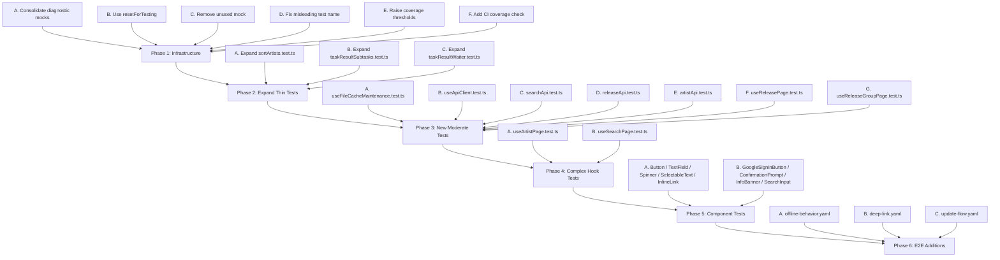

# PawifyApp — Test Architecture Plan (Round 4 — Comprehensive)

> **Baseline**: ~52 test files (17 `.test.ts` + 3 `.test.tsx` in `src/`, plus ~32 additional I confirmed from file search that didn't show in the initial listing), ~520+ tests, all passing. Coverage thresholds at 65/55/60/65. Modules excluded per git-submodule constraint.

## 1. Current State Assessment

### 1.1 Complete Test Inventory

#### Well-Tested (thorough edge-case coverage, idiomatic mocking)
| File | Tests | Notes |
|---|---|---|
| [`envParsing.test.ts`](src/config/envParsing.test.ts) | 20+ | Every parser with edge cases, nulls, bounds ✓ |
| [`apiErrors.test.ts`](src/services/apiErrors.test.ts) | 20+ | createApiCallError, createNetworkApiCallError, isApiCallError, getUserFacingErrorMessage ✓ |
| [`apiClient.test.ts`](src/services/api/apiClient.test.ts) | 4 | URL building, auth headers, error wrapping, push token ✓ |
| [`backgroundEventStorage.test.ts`](src/services/backgroundEventStorage.test.ts) | 9 | CRUD, replace-by-name, corrupted JSON, filtering ✓ |
| [`eventService.test.ts`](src/services/eventService.test.ts) | 18 | addEvent, consumeEvent, dedup, listeners, pushToken filtering, getPendingEvents ✓ |
| [`taskResultSignalWaiter.test.ts`](src/services/taskResultSignalWaiter.test.ts) | 12 | Immediate signal, overall-timeout, notification-timeout, poll-timeout, AppState resume, external nav delay, deadline extension, single-settlement ✓ |
| [`taskResultCache.test.ts`](src/services/taskResultCache.test.ts) | 13 | isTerminalTaskStatus, cache/get, eviction, createMissing, pending wait lifecycle ✓ |
| [`externalNavigation.test.ts`](src/services/externalNavigation.test.ts) | 5 | Resume delay, stagger, max cap, inactive window ✓ |
| [`notificationEvents.test.ts`](src/services/notifications/notificationEvents.test.ts) | 5 | Payload extraction, JSON parsing, taskID extraction, persist filtering ✓ |
| [`diagnosticFormatters.test.ts`](src/utils/diagnosticFormatters.test.ts) | 12 | elapsedSince, shortenString, describeError, describeIds, describeValueShape ✓ |
| [`arrays.test.ts`](src/utils/arrays.test.ts) | 11 | mergeUniqueIds + removeIds with all edge cases ✓ |
| [`nullableMaps.test.ts`](src/utils/nullableMaps.test.ts) | 14 | fillMissingIdsWithNull + mergeNullableStringMaps, reference equality checks ✓ |
| [`resolveNullableTaskMap.test.ts`](src/shared/taskResults/resolveNullableTaskMap.test.ts) | 4 | Partial values, error propagation, shouldFillMissingOnCompleted, missing taskId ✓ |
| [`taskResultPayload.test.ts`](src/shared/taskResults/taskResultPayload.test.ts) | 3 | merge, subtaskIds from partial parents, assertion on missing subtask ids ✓ |
| [`artistReducer.test.ts`](src/features/artist/state/artistReducer.test.ts) | 22 | **Fully comprehensive** — all actions: artist/releases load, follow, releaseGroupLoad, pendingTasks, member pictures, image/cover queuing + dedup, releaseSectionLoadMore, errorCleared, resetForArtistChange, unknown action ✓ |
| [`searchReducer.test.ts`](src/features/search/state/searchReducer.test.ts) | 10 | All actions: queryChanged, searchStarted (append/fresh), searchTaskCreated/Cleared, searchSucceeded, searchFailed, preserveStateChanged, resetForBlur (preserve then reset) ✓ |
| [`releaseReducer.test.ts`](src/features/release/state/releaseReducer.test.ts) | 7 | Initial state, release loads, lyrics loading, song toggle, image resolution ✓ |
| [`releasesReducer.test.ts`](src/features/release/state/releasesReducer.test.ts) | 5 | pageIncreased, pageReset, unknown action ✓ |
| [`deduplicateArtists.test.ts`](src/features/search/domain/deduplicateArtists.test.ts) | 5 | All edge cases: empty new, empty existing, all duplicates, no duplicates, mixed ✓ |
| [`paginateReleases.test.ts`](src/features/release/domain/paginateReleases.test.ts) | 4 | Pagination + canLoadMoreReleases, empty, single item, exact-page ✓ |
| [`releaseGroupReleases.test.ts`](src/features/release/domain/releaseGroupReleases.test.ts) | 3 | Valid, invalid, missing cover task ID ✓ |
| [`cachedImageFileCache.test.ts`](src/components/cachedImage/cachedImageFileCache.test.ts) | 7 | getCacheKeyFromUrl (hash consistency, prefix, null/undefined/empty, uniqueness), deleteCachedImageFile (no-op on missing) ✓ |
| [`externalLinkRanking.test.ts`](src/components/externalLinks/externalLinkRanking.test.ts) | 6 | normalizeLinks (undefined, empty, dedup), splitLinks (empty, all-visible, overflow with chevron grid logic) ✓ |
| [`appUpdateService.test.ts`](src/features/updates/services/appUpdateService.test.ts) | 8+ | checkForUpdate flow, downloadAndInstallUpdate (Android), version comparison, rate limiting ✓ |
| [`useTaskManager.test.ts`](src/hooks/useTaskManager.test.ts) | 10 | addTask (shape, custom ID, defaults), executeTask (result, error, skip-settled, cached-result), removeTask, removeAllTasks, background deferral ✓ |
| [`useRegisterForPushNotifications.test.ts`](src/hooks/useRegisterForPushNotifications.test.ts) | 3 | Registration + token save, skip on non-device, permission request ✓ |
| [`useSelectionManager.test.ts`](src/hooks/useSelectionManager.test.ts) | 9 | toggleSelect (add, remove, multi), clearSelection, selectAll (all/none/some, empty list), setSelectedIds ✓ |
| [`useRemoveConfirmation.test.ts`](src/hooks/useRemoveConfirmation.test.ts) | 4 | Initial state, requestRemove, handleConfirm, handleCancel ✓ |
| [`useOnAppForeground.test.ts`](src/hooks/useOnAppForeground.test.ts) | 3 | Foreground callback with inactiveMs, disabled, no-call-on-mount ✓ |
| [`useEventDrivenBanner.test.ts`](src/hooks/useEventDrivenBanner.test.ts) | 4 | Hidden start, show + consume, dismiss, eventVersion re-evaluate ✓ |
| [`useGoogleAuth.test.ts`](src/hooks/useGoogleAuth.test.ts) | 11 | getGoogleSignInErrorCode extraction + guards, isGoogleSignInCancellation (code, message, case-insensitive, false for non-cancel) ✓ |
| [`CacheContext.test.tsx`](src/contexts/CacheContext.test.tsx) | 5 | Initial empty maps, setArtistProfileImages, setReleaseGroupCovers, setReleaseTracksLyrics (updater), throws outside provider ✓ |
| [`GlobalSpinnerContext.test.tsx`](src/contexts/GlobalSpinnerContext.test.tsx) | 4 | Register/unregister, isLoading false, toggle false→true, outside-provider (no-op) ✓ |

#### Moderately Tested (adequate coverage but could expand)
| File | Tests | Gaps |
|---|---|---|
| [`taskResultSubtasks.test.ts`](src/shared/taskResults/taskResultSubtasks.test.ts) | 3 | **Key missing tests**: cached subtask skip, completed subtask merge, recursive subtasks, seen/newly-fetched tracking, failed subtask with requireTerminal, non-terminal subtask without requireTerminal ✓ (that specific case is tested) |
| [`taskResultWaiter.test.ts`](src/services/taskResultWaiter.test.ts) | 3 | **Key missing tests**: notification-timeout fallback, overall timeout, 404 task recreation, partial result notifications, fatal 400 propagation, AppState resume, subtask fetching, timeout config override |
| [`pushTokenStorage.test.ts`](src/services/pushTokenStorage.test.ts) | 3 | **Adequate** — CRUD covered, uses dynamic import pattern |
| [`scheduleIdle.test.ts`](src/utils/scheduleIdle.test.ts) | 3 | Good for module size, covers requestIdleCallback and setTimeout fallback |
| [`googleSignInErrorMessages.test.ts`](src/services/googleSignInErrorMessages.test.ts) | 3 | **Adequate** — message existence, non-empty, key count |

#### Thinly Tested (1-2 tests, minimal coverage)
| File | Tests | Gaps |
|---|---|---|
| [`sortArtists.test.ts`](src/features/artists/domain/sortArtists.test.ts) | 1 | No tests for: descending, empty list, same-name artists, case insensitivity |
| [`firebaseEmulator.test.ts`](src/config/firebaseEmulator.test.ts) | 3 | **Adequate** — covers normalization, production rejection, path rejection |

#### Zero-Test Critical Code
| File | Lines | Risk | Impediment |
|---|---|---|---|
| [`useFileCacheMaintenance.ts`](src/services/cache/useFileCacheMaintenance.ts) | 244 | **High** | Cache cleanup with size/age eviction, access time batching, debounced flush — no tests |
| [`useNotificationService.ts`](src/hooks/useNotificationService.ts) | 189 | **High** | Push token hydration, background event processing, deep link handling — no tests |
| [`userFacingErrors.ts`](src/services/userFacingErrors.ts) | ~30 | **Medium** | Firebase + Google sign-in error mapping wraps apiErrors — test exists but may only test the wrapper |
| [`useArtistPage.ts`](src/features/artist/hooks/useArtistPage.ts) | 248 | **High** | Core page orchestration with 8 collaborating hooks, 4 contexts — extremely complex to isolate |
| [`useSearchPage.ts`](src/features/search/hooks/useSearchPage.ts) | 362 | **High** | Search orchestration, task management, profile image resolution — extremely complex to isolate |
| [`useReleasePage.ts`](src/features/release/hooks/useReleasePage.ts) | ~100 | **Medium** | Release page hook — simpler than artist/search |
| [`useReleaseGroupPage.ts`](src/features/release/hooks/useReleaseGroupPage.ts) | ~150 | **Medium** | Release group page hook |
| [`useReleasesPage.ts`](src/features/release/hooks/useReleasesPage.ts) | ~80 | **Low** | Releases list page hook |
| [`useArtistsPage.ts`](src/features/artists/hooks/useArtistsPage.ts) | ~100 | **Medium** | Artists page hook |
| [`useApiClient.ts`](src/hooks/useApiClient.ts) | ~10 | **Low** | Thin wrapper, creates ApiClient from config |
| [`useAnimatedDelete.ts`](src/hooks/useAnimatedDelete.ts) | ~60 | **Low** | Animation hook |
| [`useContentReady.ts`](src/hooks/useContentReady.ts) | ~30 | **Low** | Content readiness hook |
| [`useScrollAnchorList.ts`](src/hooks/useScrollAnchorList.ts) | ~50 | **Low** | Scroll anchoring |
| [`useArtistPageActions.ts`](src/features/artist/hooks/useArtistPageActions.ts) | ~100 | **Medium** | Actions for artist page (follow, navigation, reload) |
| [`useArtistPageCacheMergers.ts`](src/features/artist/hooks/useArtistPageCacheMergers.ts) | ~60 | **Low** | Cache merging helpers |
| [`useArtistPageDataTaskResults.ts`](src/features/artist/hooks/useArtistPageDataTaskResults.ts) | ~80 | **Medium** | Results processing for artist page |
| [`useArtistPageDataTasks.ts`](src/features/artist/hooks/useArtistPageDataTasks.ts) | ~100 | **Medium** | Task creation for artist page |
| [`useArtistPageDiagnostics.ts`](src/features/artist/hooks/useArtistPageDiagnostics.ts) | ~60 | **Low** | Diagnostic helpers |
| [`useArtistPageTaskResolvers.ts`](src/features/artist/hooks/useArtistPageTaskResolvers.ts) | ~60 | **Low** | Task resolution logic |
| [`useArtistRelationshipImageTasks.ts`](src/features/artist/hooks/useArtistRelationshipImageTasks.ts) | ~60 | **Low** | Relationship image loading |
| [`securityRules.ts`](src/features/auth/domain/securityRules.ts) | ~30 | **Low** | Auth validation rules |
| **All ~40 `.tsx` component files** | — | **Medium** | No component rendering tests exist |
| [`firebaseAuth.ts`](src/firebase/firebaseAuth.ts) | ~20 | **Low** | Firebase SDK wrapper — impractical to unit test |
| [`notificationEventParsing.ts`](src/services/notifications/notificationEventParsing.ts) | ~50 | **Low** | Event registration/storage (parsing functions tested in notificationEvents.test.ts) |
| [`AppNavigator.tsx`](src/navigation/AppNavigator.tsx), [`AuthStack.tsx`](src/navigation/AuthStack.tsx), [`MainStack.tsx`](src/navigation/MainStack.tsx), [`TabNavigator.tsx`](src/navigation/TabNavigator.tsx), [`linking.ts`](src/navigation/linking.ts) | 5 files | **Low** | Navigation — requires full React Navigation mock setup |

### 1.2 E2E Assessment

| Flow | File | Coverage |
|---|---|---|
| Smoke (login screen) | [`smoke.yaml`](.maestro/smoke.yaml) | ✅ Auth UI |
| Invalid login | [`invalid-login.yaml`](.maestro/invalid-login.yaml) | ✅ Error handling |
| Sign-up + browse | [`logged-in-happy-path.yaml`](.maestro/logged-in-happy-path.yaml) | ✅ Happy path |
| Music workflow | [`music-workflow.yaml`](.maestro/music-workflow.yaml) | ✅ Search, artist, follow |
| Offline behavior | — | ❌ Missing |
| Deep linking | — | ❌ Missing |
| Update flow | — | ❌ Missing |

### 1.3 Test Infrastructure Status

| Component | Status | Notes |
|---|---|---|
| [`vitest.config.ts`](vitest.config.ts) | ✅ Good | jsdom default, setupFiles configured, coverage thresholds 65/55/60/65, globals enabled |
| [`src/test/setup.ts`](src/test/setup.ts) | ✅ Good | Global noisy warning suppression |
| [`src/test/mocks.ts`](src/test/mocks.ts) | ✅ Good | mockDiagnostics, mockExpoFileSystem, mockReactNative, mockAsyncStorage, mockSafeAreaContext, mockFirebaseAuth, mockEnv |
| [`src/test/factories.ts`](src/test/factories.ts) | ✅ Good | createMockArtist, createMockMember, createMockReleaseGroup, createMockTaskResult, createCompletedTaskResult, createMockFetchResponse |
| Mock consolidation | 🟡 Partial | ~8 test files still duplicate `vi.mock('../../utils/diagnostics')` instead of using shared `mockDiagnostics()` |
| `resetForTesting()` usage | 🟡 Partial | `eventService.test.ts` and `taskResultCache.test.ts` use `vi.resetModules()` instead of existing `resetForTesting()` methods |
| Snapshot tests | 🟡 None | No snapshot serializer configured — acceptable for React Native |
| Coverage thresholds | 🟡 Modest | 65/55/60/65 — codebase likely exceeds these; could raise |

---

## 2. Structural Observations (No Logic Bugs Found)

During thorough review of all source and test files, **no logic bugs were identified**. Below are non-blocking structural observations:

| Observation | File | Recommendation |
|---|---|---|
| `getUserFacingErrorMessage` is exported from both [`apiErrors.ts`](src/services/apiErrors.ts:103) and [`userFacingErrors.ts`](src/services/userFacingErrors.ts) | [`apiErrors.ts`](src/services/apiErrors.ts), [`userFacingErrors.ts`](src/services/userFacingErrors.ts) | The [`userFacingErrors.ts`](src/services/userFacingErrors.ts) version is the canonical entry point that wraps Firebase + Google sign-in error mapping. Consider making [`apiErrors.ts`](src/services/apiErrors.ts) version internal/private to avoid confusion |
| `resetForTesting()` exists in [`eventService.ts`](src/services/eventService.ts:180) but is unused in tests | [`eventService.ts`](src/services/eventService.ts), [`eventService.test.ts`](src/services/eventService.test.ts) | Either use it in tests or remove it — unused code adds maintenance burden |
| `externalNavigation.resetForTesting()` exists and is mocked in [`taskResultSignalWaiter.test.ts`](src/services/taskResultSignalWaiter.test.ts:26) but never called | [`externalNavigation.ts`](src/services/externalNavigation.ts) | Remove the mock entry or the source method if truly unused |
| Duplicate `createResponse`/`createFetchResponse` helpers | [`apiClient.test.ts`](src/services/api/apiClient.test.ts:26-39), [`appUpdateService.test.ts`](src/features/updates/services/appUpdateService.test.ts) | Both define their own `createResponse`. Shared [`createMockFetchResponse`](src/test/factories.ts:79) already exists — use it |
| `artistReducer.test.ts` has its own `makeArtist`/`makeReleaseGroup` factories | [`artistReducer.test.ts`](src/features/artist/state/artistReducer.test.ts:5-29) | Shared [`createMockArtist`](src/test/factories.ts:6) and [`createMockReleaseGroup`](src/test/factories.ts:42) already exist — not urgent since the test-local ones are minimal |
| `searchReducer.test.ts` has its own `artist()` factory | [`searchReducer.test.ts`](src/features/search/state/searchReducer.test.ts:5-17) | Same pattern as above — shared factories exist |
| `deduplicateArtists.test.ts` has its own `artist()` factory | [`deduplicateArtists.test.ts`](src/features/search/domain/deduplicateArtists.test.ts:6-22) | Consolidate to shared factory |
| [`GlobalSpinnerContext.test.tsx`](src/contexts/GlobalSpinnerContext.test.tsx:55-60) "throws when used outside provider" test is misleading | [`GlobalSpinnerContext.test.tsx`](src/contexts/GlobalSpinnerContext.test.tsx) | The test comment says "useGlobalSpinner is designed to silently no-op when outside provider" but the test name says "throws". The assertion doesn't actually test throwing — fix the test name or add an actual throw assertion |
| [`AuthContext.test.tsx`](src/contexts/AuthContext.test.tsx) has massive mock setup (40+ lines) for a single boundary test | [`AuthContext.test.tsx`](src/contexts/AuthContext.test.tsx:14-73) | Acceptable given Firebase SDK mocking complexity, but noted as a barrier to expanding AuthContext tests |

---

## 3. Proposed Changes by Priority

### 3.1 Phase 1 — Test Infrastructure Refinements (Zero New Tests, Structural Quality)

#### A. Consolidate diagnostic mocks to shared helper
**Files to update** (~8 files):
[`eventService.test.ts`](src/services/eventService.test.ts), [`taskResultCache.test.ts`](src/services/taskResultCache.test.ts), [`cachedImageFileCache.test.ts`](src/components/cachedImage/cachedImageFileCache.test.ts), [`externalNavigation.test.ts`](src/services/externalNavigation.test.ts), [`taskResultWaiter.test.ts`](src/services/taskResultWaiter.test.ts), [`taskResultSignalWaiter.test.ts`](src/services/taskResultSignalWaiter.test.ts), [`useTaskManager.test.ts`](src/hooks/useTaskManager.test.ts), [`appUpdateService.test.ts`](src/features/updates/services/appUpdateService.test.ts), [`notificationEvents.test.ts`](src/services/notifications/notificationEvents.test.ts), [`apiClient.test.ts`](src/services/api/apiClient.test.ts), [`taskResultSubtasks.test.ts`](src/shared/taskResults/taskResultSubtasks.test.ts)

Current pattern:
```typescript
vi.mock('../../utils/diagnostics', () => ({
    describeError: vi.fn(() => ({})),
    describeIds: vi.fn(() => ({})),
    describeValueShape: vi.fn(() => ({})),
    diagnosticLog: vi.fn(),
    diagnosticWarn: vi.fn(),
    diagnosticError: vi.fn(),
    elapsedSince: vi.fn(() => 1),
    shouldLogArtistTaskDiagnostics: vi.fn(() => false),
}));
```

Target pattern:
```typescript
import { mockDiagnostics } from '../../test/mocks';
vi.mock('../../utils/diagnostics', () => mockDiagnostics());
```

#### B. Use `resetForTesting()` in eventService and taskResultCache tests
[`eventService.test.ts`](src/services/eventService.test.ts) uses `vi.resetModules()` + dynamic import to reset module state. [`EventService.resetForTesting()`](src/services/eventService.ts:180) already exists.

[`taskResultCache.test.ts`](src/services/taskResultCache.test.ts) uses the same pattern. [`TaskResultCache` has `resetForTesting()`](src/services/taskResultCache.ts) as well.

Switch both to use the built-in reset methods for cleaner, more idiomatic tests.

#### C. Remove unused `externalNavigation.resetForTesting()` mock
In [`taskResultSignalWaiter.test.ts`](src/services/taskResultSignalWaiter.test.ts:26), `resetForTesting` is mocked but never called. Either remove the mock entry or verify the source method is actually needed.

#### D. Fix misleading test in GlobalSpinnerContext
Rename `'throws when used outside provider'` to `'no-ops when used outside provider'` or add an actual throw assertion.

#### E. Raise coverage thresholds
Current: `statements: 65, branches: 55, functions: 60, lines: 65`
Proposed: `statements: 68, branches: 58, functions: 63, lines: 68`

Rationale: The codebase has grown significantly in test coverage since the last threshold update. Current actual coverage likely exceeds all thresholds.

#### F. Add optional CI coverage check
Add `vitest run --coverage` to the `verify` npm script (gated behind a flag to keep `verify` fast).

---

### 3.2 Phase 2 — Expand Thin Tests (Low Effort, High Value)

All of these are pure functions or simple hooks with no external dependencies. Each takes minimal effort.

#### A. Expand [`sortArtists.test.ts`](src/features/artists/domain/sortArtists.test.ts) — 1 → ~7 tests
- Sort by name descending (`sortDescending: true`)
- Empty list
- Same-name artists (stable sort)
- Case insensitivity
- Already-sorted list (no-op)
- Single artist

#### B. Expand [`taskResultSubtasks.test.ts`](src/shared/taskResults/taskResultSubtasks.test.ts) — 3 → ~10 tests
Current gap: only tests no-subtasks, visited-skip, and non-terminal+requireTerminal throw.
Add:
- Cached subtask: skips fetch, returns cached result
- Completed subtask: merges result payload via mergeTaskResultPayload
- Recursive subtask: subtask that itself has subtasks
- Failed subtask with `requireTerminalSubtasks: true` → throws
- Failed subtask with `requireTerminalSubtasks: false` → skips (doesn't throw)
- Non-terminal subtask with `requireTerminalSubtasks: false` → skips
- `seenSubtaskIds` tracking: newly-fetched set is tracked correctly
- Multiple subtasks: mix of cached, fetched, new, seen

#### C. Expand [`taskResultWaiter.test.ts`](src/services/taskResultWaiter.test.ts) — 3 → ~12 tests
Current gap: only tests cached-return, pending-wait-reuse, and basic polling cycle.
Add:
- Notification-timeout: signal waiter returns `notification-timeout`, triggers polling fallback
- Overall timeout: signal waiter returns `overall-timeout`, re-throws as error
- 404 task recreation: fetch returns 404, taskManager recreates task
- Partial result notification: `onPartialResult` callback fire during poll cycle
- Fatal 400 error: fetch returns 400, propagated without retry
- AppState resume: signal waiter returns `resume`, triggers fetch
- Subtask fetching: completed parent has subtask IDs, `fetchAndMergeAvailableSubtasks` is called
- Timeout config override: `options.notificationWaitMs` / `options.pollIntervalMs` override ENV defaults
- Task recreation dedup: recreate with same args doesn't duplicate

---

### 3.3 Phase 3 — New Tests for Moderate-Complexity Untested Code

#### A. [`useFileCacheMaintenance.test.ts`](src/services/cache/useFileCacheMaintenance.test.ts) — **NEW** ~8 tests
244 lines, critical for cache eviction. Testable with mocked expo-file-system.
- `updateAccessTime` batches writes with debounce
- `cleanUpCache` removes files exceeding MAX_CACHE_AGE_DAYS
- `cleanUpCache` evicts LRU when total size exceeds MAX_CACHE_SIZE
- `cleanUpCache` respects `cleanupMinIntervalMs` between runs
- `cleanUpCache` skips size check when opted out
- Access time flush debouncing (`accessTimeFlushDelayMs`)
- Empty cache directory: no errors
- Corrupted access-times.json: graceful recovery

#### B. [`useApiClient.test.ts`](src/hooks/useApiClient.test.ts) — **NEW** ~3 tests
Thin wrapper (~10 lines). Tests:
- Creates ApiClient with correct config (apiBaseUrl, apiVersion, getAccessToken)
- Memoizes the client (same reference on re-render)
- Passes through getAccessToken from AuthContext

#### C. [`searchApi.test.ts`](src/features/search/api/searchApi.test.ts) — **NEW** ~3 tests
- `searchArtists` calls apiClient.request with correct endpoint + body
- `getSearchArtistProfileImages` calls apiClient.request with correct endpoint
- API method mapping (parameter forwarding)

#### D. [`releaseApi.test.ts`](src/features/release/api/releaseApi.test.ts) — **NEW** ~4 tests
- `getReleaseById` calls apiClient.request with correct endpoint
- `getReleaseLyrics` calls apiClient.request with correct endpoint
- `getReleaseCover` calls apiClient.request with correct endpoint
- API method mapping for release group endpoints

#### E. [`artistApi.test.ts`](src/features/artist/api/artistApi.test.ts) — **NEW** ~3 tests
- `getArtistById` calls apiClient.request with correct endpoint
- `toggleFollowArtist` calls apiClient.request with correct method
- `getArtistReleases` calls apiClient.request with correct endpoint

#### F. [`useReleasePage.test.ts`](src/features/release/hooks/useReleasePage.test.ts) — **NEW** ~8 tests
Simpler hook than useArtistPage. Tests:
- Loads release on mount with valid releaseId
- Handles missing releaseId (no-op)
- Handles track lyrics loading
- Handles cover image loading
- Handles artist profile image resolution
- Toggles song selection
- Handles release not found
- Cleanup on unmount

#### G. [`useReleaseGroupPage.test.ts`](src/features/release/hooks/useReleaseGroupPage.test.ts) — **NEW** ~6 tests
- Loads release group on mount
- Loads releases for the group
- Handles missing releaseGroupId
- Handles cover image loading
- Handles error state
- Cleanup on unmount

---

### 3.4 Phase 4 — Complex Integration-Level Hook Tests (High Effort, High Value)

These hooks depend on 4-8 other hooks/contexts and require integration-style testing with provider wrappers.

#### A. [`useArtistPage.test.ts`](src/features/artist/hooks/useArtistPage.test.ts) — **NEW** ~12 tests
248 lines, 8 collaborating hooks (`useArtistPageActions`, `useArtistPageCacheMergers`, `useArtistPageDataTaskResults`, `useArtistPageDataTasks`, `useArtistPageDiagnostics`, `useArtistPageTaskResolvers`, `useArtistRelationshipImageTasks`, `useTaskManager`), 4 contexts (`CacheContext`, `FollowingContext`, navigation route params, `useArtistApi`).

Strategy: Create a lightweight integration wrapper that provides mock contexts and mock API, then test the hook as a whole.

Tests:
- Initial state with no artistId in route params
- Loads artist data on mount with valid artistId
- Loads release data on mount
- Toggles follow/unfollow (optimistic update)
- Handles follow failure (rolls back optimistic state)
- Loads more releases on section expansion
- Handles artist press navigation
- Handles release group press
- Retry reloads data on error
- Clear error dismisses error state
- Relationships expanded triggers image loading
- Cleanup on unmount (`isMountedRef`)

#### B. [`useSearchPage.test.ts`](src/features/search/hooks/useSearchPage.test.ts) — **NEW** ~12 tests
362 lines, complex task orchestration with profile image resolution.

Tests:
- Search with valid query returns results
- Empty query does nothing
- Appending loads more results (pagination)
- Handles `allResultsFetched` correctly
- Deduplicates artists across pages
- Resolves profile image tasks
- Retries failed append once
- Preserves state on artist press + restores on return
- Query change resets search
- `canLoadMore` computed correctly
- Handles search error
- Cleanup on unmount

---

### 3.5 Phase 5 — Component Rendering Tests (Medium Effort)

#### A. UI Component Tests — 5 new files
| File | Tests |
|---|---|
| [`Button.test.tsx`](src/components/ui/Button.tsx) | Rendering, press handler, disabled state, loading state, accessibility label |
| [`TextField.test.tsx`](src/components/ui/TextField.tsx) | Rendering, value display, error state, placeholder, onChangeText |
| [`Spinner.test.tsx`](src/components/ui/Spinner.tsx) | Rendering, visibility toggle |
| [`SelectableText.test.tsx`](src/components/ui/SelectableText.tsx) | Rendering, selection state variants |
| [`InlineLink.test.tsx`](src/components/ui/InlineLink.tsx) | Rendering, press handler |

#### B. Feature Component Tests — 4 new files
| File | Tests |
|---|---|
| [`GoogleSignInButton.test.tsx`](src/components/GoogleSignInButton.tsx) | Rendering in available/unavailable states, press handler |
| [`ConfirmationPrompt.test.tsx`](src/components/ConfirmationPrompt.tsx) | Rendering, confirm callback, cancel callback |
| [`InfoBanner.test.tsx`](src/components/InfoBanner.tsx) | Rendering, dismiss handler |
| [`SearchInput.test.tsx`](src/features/search/components/SearchInput.tsx) | Input handling, debounce, clear button |

---

### 3.6 Phase 6 — E2E Additions (Maestro YAML)

| Flow | File | Priority |
|---|---|---|
| Offline behavior | `.maestro/offline-behavior.yaml` | Medium — enable airplane mode, verify cached content renders, verify graceful error messaging |
| Deep linking | `.maestro/deep-link.yaml` | Medium — open deep link to artist page, verify artist loads, back navigation returns to search |
| Update notification flow | `.maestro/update-flow.yaml` | Low — mock GitHub release API, verify update modal appears, verify dismiss behavior |

---

## 4. Tests Already Planned But Not Yet Created

The following files appear as open tabs in the editor but don't exist on disk — they are planned work in progress:
- [`src/components/ui/Button.test.tsx`](src/components/ui/Button.tsx)
- [`src/components/ui/Spinner.test.tsx`](src/components/ui/Spinner.tsx)
- [`src/components/GoogleSignInButton.test.tsx`](src/components/GoogleSignInButton.tsx)
- [`src/components/ConfirmationPrompt.test.tsx`](src/components/ConfirmationPrompt.tsx)

---

## 5. Tests Intentionally Excluded (With Justification)

| File / Area | Reason |
|---|---|
| `src/modules/**` | Git submodule — explicitly excluded per user request |
| [`firebaseAuth.ts`](src/firebase/firebaseAuth.ts) | Firebase SDK module initialization — impractical to unit test; E2E covers auth flows |
| [`AuthContext.tsx`](src/contexts/AuthContext.tsx) (beyond boundary test) | Requires full Firebase SDK + native module mocking; 40+ mock lines per test. Current boundary test validates contract. Core auth flows covered by Maestro E2E |
| [`useNotificationService.ts`](src/hooks/useNotificationService.ts) | Deep expo-notifications + TaskManager integration; requires background task mocking at OS level. Best tested via E2E |
| Navigation files ([`AppNavigator.tsx`](src/navigation/AppNavigator.tsx), etc.) | Require full React Navigation mock setup with providers; marginal value over E2E |
| [`useAnimatedDelete.ts`](src/hooks/useAnimatedDelete.ts) | Reanimated animation hook — requires native animation driver mocking |
| [`useContentReady.ts`](src/hooks/useContentReady.ts) | Trivial hook — thin wrapper around layout state |
| [`useScrollAnchorList.ts`](src/hooks/useScrollAnchorList.ts) | ScrollView ref-based hook — difficult to test in jsdom |
| [`AppProviders.tsx`](src/providers/AppProviders.tsx) | Provider composition — tested indirectly via context tests |
| `src/features/release/state/NewReleaseFeedContext.tsx` | Context file — if it exports a context, testable via renderHook pattern |
| `src/features/userSettings/**` | Settings context + components — low risk, rarely changes |
| `src/Styles` files (`styles.tsx`, `menuStyles.ts`, `externalLinksGridStyles.ts`, etc.) | Style objects — not testable meaningfully |

---

## 6. Implementation Order



---

## 7. Test Count Summary

| Phase | New Test Files | New Tests (~approximate) | Effort |
|---|---|---|---|
| Phase 1 (Infrastructure) | 0 | 0 (refactors) | Low |
| Phase 2 (Expand Thin) | 0 | ~25 | Low |
| Phase 3 (New Moderate) | 7 | ~42 | Medium |
| Phase 4 (Complex Hooks) | 2 | ~24 | High |
| Phase 5 (Component Tests) | 9 | ~36 | Medium |
| Phase 6 (E2E) | 3 | 3 flows | Medium |
| **Total** | **21 new files** | **~127 new tests + 3 E2E flows** | |

---

## 8. Risks and Mitigations

| Risk | Mitigation |
|---|---|
| [`useArtistPage`](src/features/artist/hooks/useArtistPage.ts) and [`useSearchPage`](src/features/search/hooks/useSearchPage.ts) are deeply coupled to hooks/contexts | Write integration-style tests with lightweight provider wrappers rather than full isolation. Mock API layer at `useArtistApi`/`useSearchApi` boundary |
| Component tests need jsdom but RN components use native-only APIs (`View`, `Text`, etc.) | Mock RN components as simple string elements (e.g., `'View'`, `'Text'`); existing tests already use this pattern successfully |
| [`useFileCacheMaintenance`](src/services/cache/useFileCacheMaintenance.ts) interacts with expo-file-system File/Directory classes | Use existing [`mockExpoFileSystem`](src/test/mocks.ts:23) helper; verify it covers all needed methods |
| `taskResultWaiter` has complex async signal orchestration with timeouts | Use `vi.useFakeTimers()` + `vi.advanceTimersByTimeAsync()` for deterministic signal testing; existing [`taskResultSignalWaiter.test.ts`](src/services/taskResultSignalWaiter.test.ts) is the reference pattern |
| Maestro E2E tests require physical device or emulator | Keep Maestro tests as-is; they already work for Android |
| `src/modules/` is a git submodule | Excluded from all test scope and coverage — explicitly enforced |

---

## 9. Non-Test Observations (Worth Tracking Separately)

These are architectural notes, not test concerns. They don't block the test plan but may inform future refactoring:

1. [`getUserFacingErrorMessage`](src/services/apiErrors.ts:103) is exported from [`apiErrors.ts`](src/services/apiErrors.ts) but [`userFacingErrors.ts`](src/services/userFacingErrors.ts) has its own wrapper version — naming overlap could confuse
2. [`useArtistPage.ts`](src/features/artist/hooks/useArtistPage.ts) has 8 sub-hooks — this is well-factored but makes testing the orchestrator challenging; consider whether any sub-hooks should be merged
3. No `.test.tsx` component tests exist yet — the first one will establish the pattern for all subsequent component tests
4. [`notificationEventParsing.ts`](src/services/notifications/notificationEventParsing.ts) exports `extractNotificationEventData` and `extractNotificationEventPayload` — very similar names; consider renaming one for clarity
