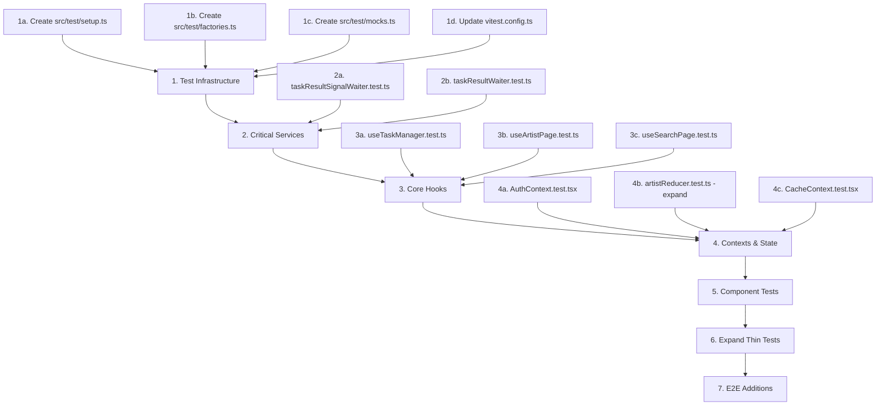

# PawifyApp — Comprehensive Test Architecture Plan

## 1. Current State Assessment

### 1.1 Test Inventory

| Category | Count | Status |
|---|---|---|
| Unit tests (`.test.ts`) | 30 files | Good coverage of pure logic, gaps in hooks/services/components |
| Component tests (`.test.tsx`) | 0 files | **Critical gap — no component rendering tests exist** |
| Integration tests | 0 files | **Critical gap — no integration tests** |
| E2E tests (Maestro `.yaml`) | 4 flows | Covers smoke, login, music workflow, invalid login |
| Test configuration | `vitest.config.ts` | Default `node` environment, no jsdom for most component tests |

### 1.2 Existing Tests by Layer

**Well-tested (high coverage):**
- `src/config/envParsing.test.ts` — Parsers with edge cases ✓
- `src/config/firebaseEmulator.test.ts` — Emulator URL logic ✓
- `src/services/apiErrors.test.ts` — Error creation, type guards, message extraction ✓
- `src/services/userFacingErrors.test.ts` — Firebase auth + Google sign-in error mapping ✓
- `src/services/eventService.test.ts` — Event dedup, listeners, push token filtering ✓
- `src/services/backgroundEventStorage.test.ts` — Storage CRUD, corrupted data handling ✓
- `src/services/api/apiClient.test.ts` — Request building, auth headers, error wrapping ✓
- `src/utils/diagnosticFormatters.test.ts` — Formatter utilities ✓
- `src/utils/nullableMaps.test.ts` — Map merging with reference equality ✓
- `src/utils/arrays.test.ts` — Array merging and removal ✓
- `src/features/artist/domain/releaseSections.test.ts` — Section grouping and sorting ✓

**Thinly tested (minimal coverage):**
- `src/components/cachedImage/cachedImageFileCache.test.ts` — **Only tests [`getCacheKeyFromUrl`](src/components/cachedImage/cachedImageFileCache.ts:51)**;  [`resolveCachedImageUri`](src/components/cachedImage/cachedImageFileCache.ts:65) and [`deleteCachedImageFile`](src/components/cachedImage/cachedImageFileCache.ts:32) are untested
- `src/components/externalLinks/externalLinkRanking.test.ts` — **Single test case** for the full pipeline; no edge cases for empty lists, all overflow, boundary size
- `src/features/search/domain/deduplicateArtists.test.ts` — **Single test case**; no tests for empty existing, empty incoming, all duplicates
- `src/features/updates/services/appUpdateService.test.ts` — Only tests [`checkForUpdate`](src/features/updates/services/appUpdateService.ts) flow;  [`downloadAndInstallUpdate`](src/features/updates/services/appUpdateService.ts) and [`openUpdate`](src/features/updates/services/appUpdateService.ts) minimally exercised

### 1.3 Untested Critical-Path Code

| File | Risk | Reason |
|---|---|---|
| [`useArtistPage.ts`](src/features/artist/hooks/useArtistPage.ts) | **High** | Core page orchestration (247 lines), no tests |
| [`useSearchPage.ts`](src/features/search/hooks/useSearchPage.ts) | **High** | Search orchestration with task management (362 lines), no tests |
| [`taskResultWaiter.ts`](src/services/taskResultWaiter.ts) | **High** | Core async wait/poll/recreate loop (392 lines), no tests |
| [`taskResultSignalWaiter.ts`](src/services/taskResultSignalWaiter.ts) | **High** | Signal-based wait with AppState integration (161 lines), no tests |
| [`AuthContext.tsx`](src/contexts/AuthContext.tsx) | **High** | Authentication state, token refresh, sign-out (193 lines), no tests |
| [`useFileCacheMaintenance.ts`](src/services/cache/useFileCacheMaintenance.ts) | **Medium** | Cache cleanup with size/age eviction (243 lines), no tests |
| [`useRegisterForPushNotifications.ts`](src/hooks/useRegisterForPushNotifications.ts) | **Medium** | Push registration flow, no tests |
| [`useTaskManager.ts`](src/hooks/useTaskManager.ts) | **Medium** | Generic task queue/execution hook, no tests |
| [`ArtistPage.tsx`](src/features/artist/pages/ArtistPage.tsx) | **Medium** | Page component, no rendering tests |
| [`SearchPage.tsx`](src/features/search/pages/SearchPage.tsx) | **Medium** | Page component, no rendering tests |
| [`ReleaseGroupPage.tsx`](src/features/release/pages/ReleaseGroupPage.tsx) | **Medium** | Page component, no rendering tests |
| [`artistReducer.ts`](src/features/artist/state/artistReducer.ts) | **Low** | Partially tested (dedup + removal covered, other actions not tested) |

### 1.4 Test Infrastructure Gaps

| Issue | Impact |
|---|---|
| `vitest.config.ts` uses `environment: 'node'` by default | `@testing-library/react` render tests only work if consumer opts into jsdom via docblock |
| No shared test factory functions | Duplicated mock setup across many test files |
| No shared `setup.ts` for global mocks (`expo-file-system`, `react-native`, diagnostics) | Each test file independently mocks the same dependencies |
| No snapshot serializer configuration | UI snapshot tests not feasible without setup |
| [`resetForTesting`](src/services/eventService.ts:180) methods exist but are inconsistently used | Tests rely on `vi.resetModules()` + dynamic import instead |
| No coverage threshold configured in vitest | No enforcement of coverage goals |
| No `.test.tsx` files exist at all | Zero component rendering confidence |

---

## 2. Proposed Structural Changes

### 2.1 Test Infrastructure Improvements

#### A. Create shared test setup

**New file:** `src/test/setup.ts`

```typescript
// Global mock setup loaded once via vitest.config.ts setupFiles
// Mock react-native, expo-file-system, diagnostics for all tests
// Can be overridden per-test as needed
```

**New file:** `src/test/factories.ts`

```typescript
// Shared test data factories:
// - createMockArtist(overrides?)
// - createMockReleaseGroup(overrides?)
// - createMockRelease(overrides?)
// - createMockTaskResult(overrides?)
// - createMockApiResponse(status, data?)
```

**New file:** `src/test/mocks.ts`

```typescript
// Standardized mock helpers:
// - mockDiagnostics()
// - mockExpoFileSystem()
// - mockReactNative(platform?)
// - mockAsyncStorage()
// - mockEnv(overrides?)
```

#### B. Update vitest configuration

**Modify:** `vitest.config.ts`

- Set `environment: 'jsdom'` as default (most imports need react-native mocks that import DOM-like APIs)
- Add `setupFiles: ['./src/test/setup.ts']`
- Add `coverage` configuration with thresholds
- Add `globals: true` to avoid importing `describe`/`it`/`expect` everywhere

#### C. Add coverage thresholds

```typescript
coverage: {
  provider: 'v8',
  thresholds: {
    statements: 70,
    branches: 65,
    functions: 70,
    lines: 70,
  },
  include: ['src/**/*.{ts,tsx}'],
  exclude: [
    'src/modules/**',
    'src/test/**',
    'src/**/*.test.{ts,tsx}',
  ],
}
```

### 2.2 Tests to Add (Priority-Ordered)

#### Phase 1 — Critical Services & Hooks (no existing tests)

1. **[`taskResultWaiter.test.ts`](src/services/taskResultWaiter.ts)** — **HIGH PRIORITY**
   - Test: successful terminal fetch on first poll
   - Test: wait for event signal before polling
   - Test: notification-timeout fallback to polling
   - Test: overall timeout throws error
   - Test: task recreation on 404
   - Test: cache hit skips waiting
   - Test: pending wait reuse
   - Test: partial result notification
   - Test: fatal 400 error propagation
   - Test: subtask fetching and merging
   - Test: AppState resume signal

2. **[`taskResultSignalWaiter.test.ts`](src/services/taskResultSignalWaiter.ts)** — **HIGH PRIORITY**
   - Test: immediate event signal when task already pending
   - Test: overall-timeout returned when deadline exceeded
   - Test: AppState change triggers resume signal after inactivity
   - Test: resume signal respects external navigation delay
   - Test: notification-timeout transitions to poll-timeout
   - Test: deadline extension during background time
   - Test: cleanup on settlement (no memory leaks)
   - Test: simultaneous signals only settle once

3. **[`useTaskManager.test.ts`](src/hooks/useTaskManager.ts)** — **HIGH PRIORITY**
   - Test: addTask creates task with correct shape
   - Test: executeTask runs task and stores result
   - Test: executeTask stores error on failure
   - Test: removeTask removes from state
   - Test: removeAllTasks clears all
   - Test: replay policy "both" replays on app foreground
   - Test: replay policy "foreground" only replays on foreground
   - Test: task type grouping
   - Test: diagnostic logging on task lifecycle events

4. **[`useArtistPage.test.ts`](src/features/artist/hooks/useArtistPage.ts)** — **HIGH PRIORITY**
   - Test: initial state with no artistId
   - Test: loads artist data on mount
   - Test: loads release data on mount
   - Test: toggles follow/unfollow with optimistic update
   - Test: handles follow failure (rolls back optimistic state)
   - Test: loads more releases on section expansion
   - Test: handles artist press navigation
   - Test: handles release group press
   - Test: retry reloads data on error
   - Test: clear error dismisses error state
   - Test: relationships expanded triggers image loading
   - Test: cleanup on unmount (isMountedRef)

5. **[`useSearchPage.test.ts`](src/features/search/hooks/useSearchPage.ts)** — **HIGH PRIORITY**
   - Test: search with valid query returns results
   - Test: empty query does nothing
   - Test: appending loads more results
   - Test: handles allResultsFetched correctly
   - Test: deduplicates artists across pages
   - Test: resolves profile image tasks
   - Test: retries failed append once
   - Test: preserves state on artist press + restores on return
   - Test: query change resets search
   - Test: canLoadMore computed correctly

#### Phase 2 — Context & State Tests

6. **[`AuthContext.test.tsx`](src/contexts/AuthContext.tsx)** — **HIGH PRIORITY**
   - Test: renders children when user is null (unauthenticated)
   - Test: renders children when user is set (authenticated)
   - Test: getAccessToken returns token
   - Test: getAccessToken triggers sign-out on failure
   - Test: signUp calls Firebase signUp
   - Test: signIn calls Firebase signIn
   - Test: signOut clears user and calls Firebase signOut
   - Test: Google sign-in flow
   - Test: link/unlink provider
   - Test: foreground token refresh after inactivity threshold
   - Test: idTokenChanged listener registers post-auth setup
   - Test: throws when useAuth used outside provider

7. **[`artistReducer.test.ts`](src/features/artist/state/artistReducer.ts)** — **MEDIUM PRIORITY** (expand existing)
   - Add: artistLoadStarted action
   - Add: artistLoadSucceeded action
   - Add: artistLoadFailed action
   - Add: releasesLoadStarted action
   - Add: releasesLoadSucceeded action  
   - Add: releasesLoadFailed action
   - Add: releaseGroupPressed action
   - Add: toggleFollow action (optimistic)
   - Add: toggleFollowSuccess action
   - Add: toggleFollowFailed action
   - Add: errorCleared action
   - Add: initial state shape validation

8. **[`CacheContext.test.tsx`](src/contexts/CacheContext.tsx)** — **MEDIUM PRIORITY**
   - Test: initial state
   - Test: setArtistProfileImages merges correctly
   - Test: setReleaseGroupCovers merges correctly
   - Test: throws when used outside provider

9. **[`GlobalSpinnerContext.test.tsx`](src/contexts/GlobalSpinnerContext.tsx)** — **LOW PRIORITY**
   - Test: spinner visibility state
   - Test: show/hide transitions
   - Test: throws when used outside provider

#### Phase 3 — Component Tests

10. **UI Components** — **MEDIUM PRIORITY**
    - `src/components/ui/Button.test.tsx` — Rendering, press handler, disabled state, loading state
    - `src/components/ui/TextField.test.tsx` — Rendering, value display, error state, placeholder
    - `src/components/ui/Spinner.test.tsx` — Rendering, visibility
    - `src/components/ui/SelectableText.test.tsx` — Rendering, selection state variants
    - `src/components/ui/InlineLink.test.tsx` — Rendering, press handler

11. **Feature Components** — **LOW PRIORITY**
    - `src/components/GoogleSignInButton.test.tsx` — Rendering in available/unavailable states
    - `src/components/ConfirmationPrompt.test.tsx` — Rendering, confirm/cancel callbacks
    - `src/components/InfoBanner.test.tsx` — Rendering, dismiss handler
    - `src/features/search/components/SearchInput.test.tsx` — Input handling, clear button

#### Phase 4 — Remaining Service Tests

12. **[`pushTokenStorage.test.ts`](src/services/pushTokenStorage.ts)** — **LOW PRIORITY**
    - Test: getStoredPushToken returns stored token
    - Test: getStoredPushToken returns null when not set
    - Test: setStoredPushToken persists value
    - Test: removeStoredPushToken clears value

13. **[`useFileCacheMaintenance.test.ts`](src/services/cache/useFileCacheMaintenance.ts)** — **MEDIUM PRIORITY**
    - Test: updateAccessTime batches writes
    - Test: cleanUpCache removes expired files
    - Test: cleanUpCache evicts LRU when over size limit
    - Test: cleanUpCache respects min interval between runs
    - Test: cleanUpCache skips size check variant
    - Test: access time flush debouncing

14. **[`useRegisterForPushNotifications.test.ts`](src/hooks/useRegisterForPushNotifications.ts)** — **LOW PRIORITY**
    - Test: skips registration on emulator
    - Test: requests permissions when not granted
    - Test: saves token and sets client push token on success
    - Test: handles permission denial gracefully

15. **[`useNotificationService.test.ts`](src/hooks/useNotificationService.ts)** — **LOW PRIORITY**

16. **[`useOnAppForeground.test.ts`](src/hooks/useOnAppForeground.ts)** — **LOW PRIORITY**

#### Phase 5 — Expand Existing Tests

17. **[`cachedImageFileCache.test.ts`](src/components/cachedImage/cachedImageFileCache.test.ts)** — Expand
    - Add: `resolveCachedImageUri` cache hit returns file URI
    - Add: `resolveCachedImageUri` downloads when cache miss
    - Add: `resolveCachedImageUri` retry on timeout
    - Add: `resolveCachedImageUri` fallback to remote URL on final failure
    - Add: `resolveCachedImageUri` deletes temp file on error
    - Add: `resolveCachedImageUri` zero-byte cached file triggers re-download
    - Add: `deleteCachedImageFile` deletes existing file
    - Add: `deleteCachedImageFile` no-ops for missing file
    - Add: `getCachedImageFileUri` returns correct URI format

18. **[`externalLinkRanking.test.ts`](src/components/externalLinks/externalLinkRanking.test.ts)** — Expand
    - Add: empty links returns empty visible + overflow
    - Add: links fewer than maxItems puts all in visible
    - Add: links equal to maxItems puts all in visible
    - Add: overflow handles large overflow correctly
    - Add: featured-only layouts
    - Add: edge case: single link

19. **[`deduplicateArtists.test.ts`](src/features/search/domain/deduplicateArtists.test.ts)** — Expand
    - Add: empty new artists
    - Add: empty existing artists
    - Add: all duplicates removed
    - Add: no duplicates, all kept
    - Add: mixed duplicates and new

20. **[`appUpdateService.test.ts`](src/features/updates/services/appUpdateService.test.ts)** — Expand
    - Add: `downloadAndInstallUpdate` on Android
    - Add: `downloadAndInstallUpdate` no-ops on iOS
    - Add: `openUpdate` opens GitHub release URL
    - Add: skips draft releases
    - Add: handles GitHub rate limiting
    - Add: handles network failure
    - Add: custom `updateGithubToken` header injection

### 2.3 Tests to Update / Refactor

| File | Change | Reason |
|---|---|---|
| `vitest.config.ts` | Switch default environment to `jsdom`, add `setupFiles`, add `coverage` config | Current setup blocks component testing |
| All test files using `vi.mock('../../utils/diagnostics')` | Delegate to shared `src/test/mocks.ts` helper | Eliminates 8+ duplicated mock blocks |
| `src/services/eventService.test.ts` | Use `EventService.resetForTesting()` instead of `vi.resetModules()` + dynamic import | More idiomatic, faster tests |
| `src/services/taskResultCache.test.ts` | Use `resetForTesting()` instead of `vi.resetModules()` | Consistency with eventService pattern |
| Tests without `@vitest-environment jsdom` docblock | Add environment header where needed for component tests | Explicit environment declaration |

### 2.4 Tests to Remove

| File | Reason |
|---|---|
| _(None identified)_ | All existing tests provide value, even thin ones |

### 2.5 E2E Test Improvements

| Change | Priority |
|---|---|
| Add `.maestro/release-workflow.yaml` — Browse release group, view songs, external links | MEDIUM |
| Add `.maestro/offline-behavior.yaml` — App behavior when network is unavailable | LOW |
| Add `.maestro/deep-link.yaml` — Verify deep linking into artist page | LOW |
| Consider adding Detox or detox-compatible setup for more granular E2E | LOW (Maestro is working well) |

---

## 3. Architectural Principles for Testing

### 3.1 Test Organization

```
src/
├── features/artist/
│   ├── __tests__/              # Component & integration tests
│   │   └── ArtistPage.test.tsx
│   ├── domain/
│   │   └── artistRelationships.test.ts  ← stays co-located
│   ├── state/
│   │   └── artistReducer.test.ts        ← stays co-located
│   └── hooks/
│       └── useArtistPage.test.ts        ← NEW: co-located hook test
├── test/                       # NEW: shared test infrastructure
│   ├── setup.ts
│   ├── factories.ts
│   └── mocks.ts
└── services/
    ├── taskResultWaiter.test.ts  ← NEW
    └── taskResultSignalWaiter.test.ts  ← NEW
```

### 3.2 Test Type Strategy

| Type | Tool | When to Write |
|---|---|---|
| **Pure logic tests** (parsers, formatters, reducers) | Vitest (node env) | Always. These are the cheapest and most reliable. |
| **Hook tests** | Vitest + `@testing-library/react` (`renderHook`) | For hooks with meaningful state transitions. |
| **Component rendering tests** | Vitest + `@testing-library/react` (`render`) | For components with conditional rendering, user interactions, or accessibility concerns. |
| **Integration tests** | Vitest + `@testing-library/react` (render full provider tree) | For critical user flows spanning multiple contexts. |
| **E2E tests** | Maestro (Android) | For end-to-end flows requiring real device/app. |

### 3.3 Mocking Guidelines

- **Prefer `vi.mock` at the module boundary** — Mock external dependencies (expo-file-system, react-native, firebase) at the import level
- **Use shared mock factories** — Reduce duplication via `src/test/mocks.ts`
- **Don't mock what you own** — Pure functions and reducers should be tested directly without mocking
- **Mock `fetch` at the boundary** — Use `vi.stubGlobal('fetch', mockFetch)` for network-dependent code
- **Use `vi.useFakeTimers()` for time-dependent code** — Already done well in existing tests, continue this pattern

### 3.4 Test Naming Convention

```
describe('[module or component name]', () => {
  describe('[function or method name]', () => {
    it('[describes the behavior in present tense]', () => { ... });
  });
});
```

Example: `describe('taskResultWaiter', () => { describe('waitForTaskResultFromSignals', () => { it('returns cached result without polling', () => { ... }) }) })`

---

## 4. Implementation Order



---

## 5. Risks and Considerations

| Risk | Mitigation |
|---|---|
| [`useArtistPage.ts`](src/features/artist/hooks/useArtistPage.ts) and [`useSearchPage.ts`](src/features/search/hooks/useSearchPage.ts) are deeply coupled to hooks/contexts | Write integration-style tests with a lightweight provider wrapper rather than full isolation |
| [`taskResultWaiter.ts`](src/services/taskResultWaiter.ts) has complex async signal orchestration | Use `vi.useFakeTimers()` + `vi.advanceTimersByTimeAsync()` for deterministic signal testing |
| Component tests need jsdom but RN components use native-only APIs | Mock `react-native` components as simple views; existing mock patterns are already proven |
| Maestro E2E tests require a physical device or emulator running | Keep Maestro tests as-is; they already work for Android |
| No `.test.tsx` files exist — first component test will establish the pattern | Start with simplest UI component (`Spinner`, `Button`) to validate the setup before tackling complex pages |
| `src/modules/` is a git submodule — must not be modified | Exclude from coverage and test scope |

---

## 6. Non-Test Structural Observations

During review, no **logic bugs** were found. The codebase is well-structured with clear module boundaries, consistent naming, and thoughtful error handling. Below are architectural observations (not bugs, but worth noting):

| Observation | Recommendation |
|---|---|
| [`getUserFacingErrorMessage`](src/services/apiErrors.ts:103) is exported from [`apiErrors.ts`](src/services/apiErrors.ts) but [`userFacingErrors.ts`](src/services/userFacingErrors.ts) has its own version that wraps it | Consistent, but the naming overlap could confuse. The [`userFacingErrors.ts`](src/services/userFacingErrors.ts) version is the "canonical" entry point — consider making [`apiErrors.ts`](src/services/apiErrors.ts) version private |
| [`resetForTesting`](src/services/eventService.ts:180) methods exist but aren't used in tests | Either use them consistently or remove them; they add maintenance burden |
| No `knip.json` entry for test files | Test files are correctly excluded from dead-code detection — no action needed |
| `vitest.config.ts` includes `tests/**/*.test.ts` but only [`tests/appConfig.test.ts`](tests/appConfig.test.ts) exists | Either add more root-level tests or simplify the include pattern |
