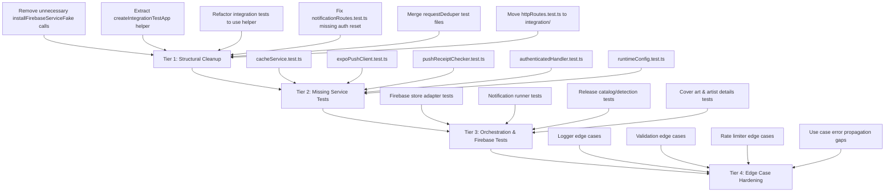

# Pawify API — Test Refactoring & Expansion Plan v2

## Audit Date: 2026-06-16

This plan is a thorough re-audit of the test suite against the current codebase. It replaces the original [`test-refactoring-plan.md`](test-refactoring-plan.md), which was partially implemented. Sections marked **DONE** were completed since the original plan; sections marked **REMAINING** still need attention.

---

## 1. What Was Already Done (from v1 Plan)

| Original Plan Item | Status | Evidence |
|---|---|---|
| Remove `test/healthRoutes.test.ts` | **DONE** | File not found in test directory |
| Split `test/daprMigration.test.ts` into 4 files | **DONE** | `daprHttpProvider.test.ts`, `daprStateCache.test.ts`, `daprLockBinding.test.ts`, `expoPushChunking.test.ts` exist |
| Fix `httpErrors.test.ts` line 37 typo (41→401) | **DONE** (already correct) | Line 38 shows `assert.equal(error.statusCode, 401)` |
| Add `getFollowing` use case tests | **DONE** | [`test/artistUseCases.test.ts`](test/artistUseCases.test.ts:218) — 3 tests |
| Add `searchArtists` use case tests | **DONE** | [`test/artistUseCases.test.ts`](test/artistUseCases.test.ts:370) — 1 test |
| Add `getRelease` use case tests | **DONE** | [`test/releaseUseCases.test.ts`](test/releaseUseCases.test.ts:116) — 2 tests |
| Add `getReleaseGroupReleases` use case tests | **DONE** | [`test/releaseUseCases.test.ts`](test/releaseUseCases.test.ts:188) — 1 test |
| Add `getReleaseNotificationSettings` tests | **DONE** | [`test/userSettingsUseCases.test.ts`](test/userSettingsUseCases.test.ts:75) — 1 test |
| Expand `notifyNewReleases` tests (error propagation) | **DONE** | [`test/notificationUseCases.test.ts`](test/notificationUseCases.test.ts:38) — 3 tests total |
| Create `test/integration/artistRoutes.test.ts` | **DONE** | 6 routes, 11 tests (400/401 validation) |
| Create `test/integration/releaseRoutes.test.ts` | **DONE** | 6 routes, 12 tests (400/401 validation) |
| Create `test/integration/userSettingsRoutes.test.ts` | **DONE** | 2 routes, 3 tests (400/401 validation) |
| Create `test/integration/taskRoutes.test.ts` | **DONE** | 1 route, 2 tests (400/401) |
| Create `test/integration/notificationRoutes.test.ts` | **DONE** | 1 route, 2 tests (API key 401) |
| Create `test/unit/common/requestDeduperRun.test.ts` | **DONE** | 4 tests: dedup, no-dedup writes, error propagation, TTL cache |
| Create `test/unit/common/requestContext.test.ts` | **DONE** | 5 tests: scope, isolation, merge, no-op |
| Add error propagation to `pushTokenUseCases.test.ts` | **DONE** | Lines 46-58, 78-90 |
| Add error propagation to `promisePool.test.ts` | **DONE** | Lines 32-47 |
| Expand `releaseFixtures.ts` | **DONE** | `createFollowedArtistSummary`, `createArtistProfileImageLookup` added |

---

## 2. Use Case Test Coverage — Current State

All use cases across all 7 feature slices are now covered with unit tests. **Zero use cases remain untested.**

| Feature | Use Case | Status | Test File |
|---|---|---|---|
| artists | `followArtist` | ✅ | `artistUseCases.test.ts` |
| artists | `unfollowArtists` | ✅ | `artistUseCases.test.ts` |
| artists | `getArtistDetails` | ✅ | `artistUseCases.test.ts` |
| artists | `getFollowing` | ✅ | `artistUseCases.test.ts` |
| artists | `searchArtists` | ✅ | `artistUseCases.test.ts` |
| auth | All 5 use cases | ✅ | `authUseCases.test.ts` |
| releases | `getNewReleases` | ✅ | `releaseUseCases.test.ts` |
| releases | `getArtistReleases` | ✅ | `releaseUseCases.test.ts` |
| releases | `removeNewReleases` | ✅ | `releaseUseCases.test.ts` |
| releases | `verifyReleaseExistence` | ✅ | `releaseExistenceUseCases.test.ts` |
| releases | `getRelease` | ✅ | `releaseUseCases.test.ts` |
| releases | `getReleaseGroupReleases` | ✅ | `releaseUseCases.test.ts` |
| notifications | `notifyNewReleases` | ✅ | `notificationUseCases.test.ts` |
| pushTokens | `savePushToken` | ✅ | `pushTokenUseCases.test.ts` |
| pushTokens | `deletePushToken` | ✅ | `pushTokenUseCases.test.ts` |
| userSettings | `updateReleaseNotificationSettings` | ✅ | `userSettingsUseCases.test.ts` |
| userSettings | `getReleaseNotificationSettings` | ✅ | `userSettingsUseCases.test.ts` |
| tasks | `getTaskResult` | ✅ | `taskUseCases.test.ts` |

---

## 3. Route Integration Test Coverage — Current State

All 8 route modules now have dedicated integration test files. The original `httpRoutes.test.ts` covers 3 modules redundantly.

| Route Module | Dedicated Test File | Status |
|---|---|---|
| healthRoutes | `httpRoutes.test.ts` (redundant) | ✅ |
| authRoutes | `httpRoutes.test.ts` (redundant) | ✅ |
| pushTokenRoutes | `httpRoutes.test.ts` (redundant) | ✅ |
| artistRoutes | `test/integration/artistRoutes.test.ts` | ✅ |
| releaseRoutes | `test/integration/releaseRoutes.test.ts` | ✅ |
| userSettingsRoutes | `test/integration/userSettingsRoutes.test.ts` | ✅ |
| taskRoutes | `test/integration/taskRoutes.test.ts` | ✅ |
| notificationRoutes | `test/integration/notificationRoutes.test.ts` | ✅ |

---

## 4. Remaining Structural Issues

### 4.1 Inconsistent Import Style (REMAINING)

Two patterns coexist:

1. **Static top-level imports** — used in `releaseUseCases.test.ts` for `getNewReleases`, `getArtistReleases`, `removeNewReleases`; used in `pushTokenUseCases.test.ts`, `notificationUseCases.test.ts`, `requestDeduper.test.ts`, etc.
2. **Dynamic `await import()` inside test bodies** — used in `artistUseCases.test.ts` for all use cases, `releaseUseCases.test.ts` for `getRelease`/`getReleaseGroupReleases`, `userSettingsUseCases.test.ts` for all use cases, all integration test files in `beforeEach`.

The dynamic pattern exists because module fakes must be installed before the module graph loads. This is a fundamental constraint of the fake installation approach (patching `require.cache`). A `test/setup.ts` preload script would be the cleanest solution but requires `--import` or `--require` support with the Node.js test runner.

**Recommendation**: Keep the dynamic import pattern for tests that need module fakes, but standardize it: always import in `beforeEach`/test body for files that depend on fakes, and always use static imports for files that don't. Add a comment explaining why dynamic imports are used.

### 4.2 No `test/setup.ts` (REMAINING)

The original plan proposed a global setup file. This doesn't exist. Given the fake installation mechanism uses `require.cache` patching, a setup file would need to run as a preload script. The Node.js test runner supports `--require` but this adds complexity to the `npm test` command. 

**Recommendation**: Lower priority. The current per-file approach works correctly and is explicit about dependencies. Only pursue a setup file if the team finds the dynamic import pattern confusing.

### 4.3 `installFirebaseServiceFake()` Called Unnecessarily (REMAINING)

[`test/artistUseCases.test.ts`](test/artistUseCases.test.ts:8) and [`test/userSettingsUseCases.test.ts`](test/userSettingsUseCases.test.ts:8) call `installFirebaseServiceFake()` at module scope, which makes all Firebase store calls throw. The tests in these files don't touch Firebase directly — they inject fake dependencies at the use case level. The Firebase fakes act as a safety net but are unnecessary.

**Recommendation**: Remove these calls. They add noise and can confuse readers about what the test actually depends on.

### 4.4 Integration Test Boilerplate Duplication (REMAINING)

All 5 integration test files share ~90% identical setup code:

```typescript
installAllFakes();
let baseUrl: string;
beforeEach(async () => {
    const { XxxRoutes } = await import('../../src/features/xxx/xxxRoutes.js');
    const app = express();
    app.use(express.json());
    const router = express.Router();
    router.use(xxxRoutes);
    app.use('/v1', router);
    app.use(errorMiddleware);
    baseUrl = await startTestServer(app);
});
afterEach(async () => {
    await stopTestServer();
    setFakeCheckAuth(async (req) => { /* default auth */ });
});
```

**Recommendation**: Extract to `test/helpers/httpTestApp.ts` as `createIntegrationTestApp(routeModule: Router): Promise<string>`. The integration test files would become:

```typescript
beforeEach(async () => {
    const { artistRoutes } = await import('../../src/features/artists/artistRoutes.js');
    baseUrl = await createIntegrationTestApp(artistRoutes);
});
afterEach(async () => {
    await stopTestServer();
});
```

### 4.5 `notificationRoutes.test.ts` Missing `setFakeCheckAuth` Reset (BUG)

[`test/integration/notificationRoutes.test.ts`](test/integration/notificationRoutes.test.ts:29) does NOT call `setFakeCheckAuth` in `afterEach`, unlike the other 4 integration files. The notification route uses API key auth, not Firebase token auth, so this is likely correct — but it's inconsistent and could cause issues if a test later changes `fakeCheckAuth` and the next test relies on the default.

**Recommendation**: Add `setFakeCheckAuth` reset to `afterEach` for consistency, or add a comment explaining why it's not needed.

### 4.6 `httpRoutes.test.ts` Partially Redundant

This file now covers health, auth, and pushToken routes — all of which also have dedicated integration test files (or are trivial). However, it also contains cross-cutting tests (404 handling, structured error body format, 400 for missing body fields) that are valuable and not duplicated elsewhere.

**Recommendation**: Keep `httpRoutes.test.ts` but rename it to `test/integration/crosscutting.test.ts` or `test/integration/errorHandling.test.ts` and remove the route-specific tests that are now covered in dedicated files. Move the pushToken route tests into a dedicated `test/integration/pushTokenRoutes.test.ts` for consistency.

### 4.7 Missing `cacheService.test.ts` (REMAINING)

The old plan listed this as NEW. It does not exist. [`src/services/cacheService.ts`](src/services/cacheService.ts) contains complex chunking logic (157 lines) with Dapr state store integration. The only test coverage is indirect via `daprStateCache.test.ts` which tests the Dapr state store adapter. The cache service itself (orchestration, chunk size calculation, metadata key generation, partial chunk recovery, TTL application) has no dedicated tests.

**Recommendation**: Create `test/unit/services/cacheService.test.ts` with:
- Round-trip get/set/delete for simple values
- Chunked value storage and retrieval
- Partial chunk recovery (some chunks missing)
- TTL metadata on save items
- Edge case: value exactly at chunk boundary
- Edge case: empty string value

---

## 5. Missing Service-Level Tests

### 5.1 `expoPushClient.test.ts` (NEW)

[`src/services/notifications/expoPushClient.ts`](src/services/notifications/expoPushClient.ts) has two exported functions (`sendExpoPushNotifications`, `getExpoPushReceipts`) and an internal helper (`readExpoData`). Zero test coverage.

**Tests needed**:
- `sendExpoPushNotifications` sends messages via Dapr HTTP and parses response data
- `getExpoPushReceipts` fetches receipts by ID
- `readExpoData` error handling: non-OK response throws with status and body
- `readExpoData` handles response with no body
- `readExpoData` handles response with body but no `data` wrapper

### 5.2 `pushReceiptChecker.test.ts` (NEW)

[`src/services/notifications/pushReceiptChecker.ts`](src/services/notifications/pushReceiptChecker.ts) is 102 lines orchestrating receipt checking, invalid token collection, and cleanup. Zero test coverage.

**Tests needed**:
- Identifies `DeviceNotRegistered` receipts and collects invalid tokens
- Deletes invalid tokens from store
- Chunks receipt IDs when count exceeds 300
- Waits `pushReceiptCheckDelayMs` before checking
- Swallows errors (catches and logs, does not throw)
- Ignores non-error receipts
- Falls back to `fallbackPushToken` when receipt lacks `expoPushToken`

### 5.3 `authenticatedHandler.test.ts` (NEW)

[`src/infrastructure/http/authenticatedHandler.ts`](src/infrastructure/http/authenticatedHandler.ts) is 47 lines wrapping handlers with auth, request scope, and cache-control headers. Zero test coverage.

**Tests needed**:
- Extracts and verifies Bearer token via `checkAuth`
- Sets `userId` on request context
- Returns 401 for invalid/missing tokens
- Sets Cache-Control headers for authenticated responses
- Calls wrapped handler on success

### 5.4 `runtimeConfig.test.ts` (NEW)

[`src/config/runtimeConfig.ts`](src/config/runtimeConfig.ts) assembles all runtime configuration from environment variables. Zero test coverage. Every other config-aware test imports from this module but never tests the config assembly directly.

**Tests needed**:
- Default values when no env vars are set
- Override via environment variables
- `parseLogLevelEnv` edge cases: invalid values fall back to 'info'
- `serverConfig`, `cacheConfig`, `musicApiConfig`, `notificationConfig`, `loggingConfig`, `monitoringConfig`, `firebaseAdminConfig` — at least one assertion per config group
- `backgroundTaskConfig` and `backgroundTaskWorkerConfig` — verify default concurrency values

### 5.5 `handlers.test.ts` — `publicHandler` (EXPAND existing)

[`test/unit/common/asyncHandler.test.ts`](test/unit/common/asyncHandler.test.ts) tests `asyncHandler` but not `publicHandler` from the same module. `publicHandler` wraps handlers with request scope, logging, and timing.

**Tests needed**:
- `publicHandler` sets `x-request-id` header on response
- `publicHandler` logs request start and completion
- `publicHandler` propagates handler errors through `asyncHandler`

### 5.6 `requestScope.test.ts` (NEW)

[`src/common/http/requestScope.ts`](src/common/http/requestScope.ts) is the core of every HTTP request's lifecycle: request ID generation, context setup, logging, timing. No direct test — only indirectly exercised through integration tests.

**Tests needed**:
- Generates UUID when no `x-request-id` header present
- Reuses `x-request-id` from header when provided
- Sets `x-request-id` on response
- Runs handler within request context
- Logs duration on completion

---

## 6. Firebase Store Adapter Tests (NEW)

The [`src/services/firebase/`](src/services/firebase/) directory contains 12+ store modules with zero dedicated tests. These are the concrete implementations of repository ports. They're used indirectly through integration tests (via mocked Firebase), but have no unit-level verification.

| Store | Key Functions | Priority |
|---|---|---|
| `pushTokenStore.ts` | `savePushTokenToDb`, `deleteDevicePushTokenFromDb`, `deleteUserPushTokensFromDb`, `deletePushTokenFromDb` | HIGH |
| `pushTokenAssignments.ts` | Push token assignment queries | MEDIUM |
| `followingStore.ts` | `getFollowingFromDb` | HIGH |
| `newReleasesStore.ts` | `getNewReleasesSnapshotFromDb`, `removeNewReleasesFromDb` | HIGH |
| `knownReleasesStore.ts` | `getKnownArtistReleaseIdsFromDb`, `getKnownReleasesFromDb` | MEDIUM |
| `userSettingsStore.ts` | Settings save/load | MEDIUM |
| `notificationRunLockStore.ts` | Lock acquire/release (already indirectly tested via `daprLockBinding.test.ts`) | LOW |
| `userStore.ts` | `checkAuth`, `deleteUserAccount` | MEDIUM |
| `missingReleaseCleanupStore.ts` | Cleanup queries | LOW |
| `artistStore.ts` | Artist data persistence | LOW |

**Recommendation**: Prioritize `pushTokenStore`, `followingStore`, and `newReleasesStore` since they're the most critical data paths. Use the existing `installFetch` pattern from `daprTestHelpers.ts` to mock Firebase RTDB/Firestore HTTP calls, or mock at the Firebase Admin SDK level.

---

## 7. Service Orchestration Tests (NEW)

These services have zero test coverage but contain significant business logic:

| Service | Lines | Description | Priority |
|---|---|---|---|
| `services/notifications/dataNotificationPublisher.ts` | ~60 | Publishes real-time data change notifications via Firebase RTDB | MEDIUM |
| `services/notifications/notificationEvents.ts` | ~40 | Event type definitions and helpers | LOW |
| `services/notifications/newReleaseNotificationRunner.ts` | ~80 | Orchestrates the full new-release notification flow | HIGH |
| `services/coverArtService.ts` | ~50 | Cover art service facade | MEDIUM |
| `services/coverArt/coverArtCache.ts` | ~80 | Cover art caching with URL resolution | MEDIUM |
| `services/coverArt/coverArtLookup.ts` | ~70 | Cover art URL lookup from multiple providers | MEDIUM |
| `services/artistDetailsService.ts` | ~100 | Artist details orchestration | MEDIUM |
| `services/backgroundTaskWorkers.ts` | ~50 | Worker registration and lifecycle | HIGH |
| `services/taskService.ts` | ~80 | Task creation, progress, completion | HIGH |
| `services/musicbrainz/cachedReleaseCatalog.ts` | ~100 | Cached release catalog with pagination | MEDIUM |
| `services/musicbrainz/newReleaseDetection.ts` | ~90 | New release detection algorithm | HIGH |
| `services/musicbrainz/releaseLookup.ts` | ~50 | Release lookup orchestration | MEDIUM |
| `services/musicbrainz/releaseQueries.ts` | ~60 | MusicBrainz query building | LOW |

---

## 8. Edge Case Hardening (REMAINING)

### 8.1 Logger Edge Cases

[`test/loggerRedaction.test.ts`](test/loggerRedaction.test.ts) tests redaction but misses:
- BigInt serialization in `safeStringify`
- Circular reference handling
- `child()` method preserves redaction behavior
- Log level filtering (debug suppressed at info level)

### 8.2 Validation Edge Cases

[`test/httpValidation.test.ts`](test/httpValidation.test.ts) tests validation but misses:
- `optionalPositiveInteger` with `undefined` value
- `requireBoolean` with string `"true"` (should reject)
- `optionalString` with empty string after trim

### 8.3 `rateLimiter.test.ts` Edge Cases

[`test/rateLimiter.test.ts`](test/rateLimiter.test.ts) misses:
- `minRateLimitWait` behavior when `retry-after` is smaller than minimum
- Backoff expiration (backoffUntil in the past)

### 8.4 Use Case Error Propagation Edge Cases

- `followArtist`: test catalog gateway failure propagation
- `getArtistDetails`: test `queueArtistProfileImagesWithLookups` failure propagation
- `getNewReleases`: test snapshot read failure propagation

---

## 9. Test Runner & Infrastructure Improvements

### 9.1 Test Command

Current: `tsc -p tsconfig.test.json && node --test "lib-test/**/*.test.js"`

This compiles ALL test files and runs them serially. Consider:
- `node --test --test-concurrency=4` for parallel execution (tests are independent)
- Separate `test:unit` and `test:integration` scripts

### 9.2 Test Organization

The current organization is already good. The only change needed:

| Current Path | Recommended | Reason |
|---|---|---|
| `test/httpRoutes.test.ts` | `test/integration/httpRoutes.test.ts` | Consistency — all other integration tests are under `test/integration/` |
| `test/requestDeduper.test.ts` | `test/unit/common/requestDeduper.test.ts` | Already exists as `requestDeduperRun.test.ts`; merge the static helper tests into it |
| *(new)* | `test/integration/pushTokenRoutes.test.ts` | Extract from `httpRoutes.test.ts` |

### 9.3 Merge `requestDeduper.test.ts` and `requestDeduperRun.test.ts`

These are two files testing the same module. The static helper tests (`classifyOperationKey`, `getDefaultInFlightDedupeAgeMs`) in `test/requestDeduper.test.ts` should be moved into `test/unit/common/requestDeduper.test.ts` (renaming the run tests file), and `test/requestDeduper.test.ts` should be deleted.

---

## 10. Files to CREATE

| File | Priority | Tier |
|---|---|---|
| `test/unit/services/cacheService.test.ts` | HIGH | 1 |
| `test/unit/services/expoPushClient.test.ts` | HIGH | 1 |
| `test/unit/services/pushReceiptChecker.test.ts` | HIGH | 1 |
| `test/unit/infrastructure/authenticatedHandler.test.ts` | HIGH | 1 |
| `test/unit/config/runtimeConfig.test.ts` | MEDIUM | 2 |
| `test/unit/services/firebase/pushTokenStore.test.ts` | MEDIUM | 2 |
| `test/unit/services/firebase/followingStore.test.ts` | MEDIUM | 2 |
| `test/unit/services/firebase/newReleasesStore.test.ts` | MEDIUM | 2 |
| `test/unit/services/newReleaseNotificationRunner.test.ts` | MEDIUM | 2 |
| `test/unit/services/cachedReleaseCatalog.test.ts` | MEDIUM | 3 |
| `test/unit/services/newReleaseDetection.test.ts` | MEDIUM | 3 |
| `test/unit/services/coverArtService.test.ts` | LOW | 3 |
| `test/unit/services/artistDetailsService.test.ts` | LOW | 3 |
| `test/unit/services/backgroundTaskWorkers.test.ts` | LOW | 3 |
| `test/unit/services/taskService.test.ts` | LOW | 3 |
| `test/integration/pushTokenRoutes.test.ts` | LOW | 3 |

---

## 11. Files to MODIFY

| File | Change | Priority |
|---|---|---|
| `test/artistUseCases.test.ts` | Remove `installFirebaseServiceFake()` call (line 8) | HIGH |
| `test/userSettingsUseCases.test.ts` | Remove `installFirebaseServiceFake()` call (line 8) | HIGH |
| `test/helpers/httpTestApp.ts` | Add `createIntegrationTestApp(router)` helper | HIGH |
| `test/integration/artistRoutes.test.ts` | Use `createIntegrationTestApp` helper | HIGH |
| `test/integration/releaseRoutes.test.ts` | Use `createIntegrationTestApp` helper | HIGH |
| `test/integration/userSettingsRoutes.test.ts` | Use `createIntegrationTestApp` helper | HIGH |
| `test/integration/taskRoutes.test.ts` | Use `createIntegrationTestApp` helper | HIGH |
| `test/integration/notificationRoutes.test.ts` | Use `createIntegrationTestApp` helper; add `setFakeCheckAuth` reset | HIGH |
| `test/httpRoutes.test.ts` | Move to `test/integration/`; extract pushToken tests; keep cross-cutting tests | MEDIUM |
| `test/requestDeduper.test.ts` | Merge into `test/unit/common/requestDeduper.test.ts` and delete | MEDIUM |
| `test/unit/common/asyncHandler.test.ts` | Add `publicHandler` tests | MEDIUM |
| `test/httpValidation.test.ts` | Add edge case tests (optionalPositiveInteger with undefined, requireBoolean with string) | LOW |
| `test/loggerRedaction.test.ts` | Add BigInt, circular ref, child(), log level tests | LOW |
| `test/rateLimiter.test.ts` | Add minRateLimitWait and backoff expiration tests | LOW |

---

## 12. Files to REMOVE

| File | Reason |
|---|---|
| `test/requestDeduper.test.ts` | Merge into `test/unit/common/requestDeduper.test.ts` (rename from `requestDeduperRun.test.ts`) |

---

## 13. Dependency Order



---

## 14. What NOT to Change

- **`src/modules/`** — Git submodule, explicitly excluded per user instructions
- **`dapr/components/*.yaml`** — Configuration files; tests that read them (like `daprHttpProvider.test.ts`) validate them but don't modify them
- **Production source code** — This plan is purely structural for tests. Bug fixes in source code are out of scope
- **Module fake mechanism** — The `require.cache` patching approach works correctly. Changes to this mechanism would require a separate architectural decision

---

## 15. Summary

| Category | Count |
|---|---|
| Use cases with zero coverage | 0 (all 18 covered) |
| Route modules without integration tests | 0 (all 8 covered) |
| New test files to create | 16 |
| Existing files to modify | 14 |
| Files to remove | 1 |
| Structural issues to fix | 6 |
| Tiers of work | 4 |
