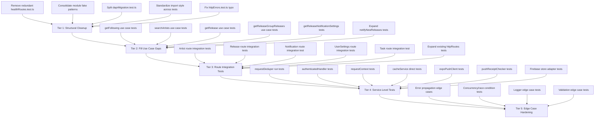
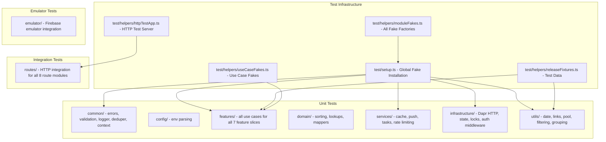

# Pawify API — Test Refactoring & Expansion Plan

## Architecture Overview

The project uses a clean **ports & adapters** (hexagonal) architecture with dependency injection. Use cases accept their dependencies as constructor parameters, making them highly testable.

```
src/
├── common/          # Shared HTTP, logging, request dedup, validation, utilities
├── config/          # Runtime config & env parsing
├── features/        # Vertical slices: ports → usecases → handlers → routes → infrastructure
│   ├── artists/     # 4 use cases (1 untested), 6 routes (0 integration-tested)
│   ├── auth/        # 5 use cases (all unit-tested), 6 routes (partially tested)
│   ├── notifications/# 1 use case (minimally tested), 1 route (untested)
│   ├── pushTokens/  # 2 use cases (unit-tested), 2 routes (partially tested)
│   ├── releases/    # 6 use cases (4 tested), 6 routes (0 integration-tested)
│   ├── tasks/       # 1 use case (tested), 1 route (untested)
│   └── userSettings/# 2 use cases (1 tested), 2 routes (untested)
├── infrastructure/  # Dapr, Firebase, Sentry, MusicBrainz mapper
├── modules/         # Git submodule (shared models, date util) — DO NOT MODIFY
├── services/        # Gateway implementations, task workers, notifications, cache
└── utils/           # Helper functions, types
```

---

## Test Coverage Matrix

### Use Cases — Unit Tested vs. Missing

| Feature | Use Case | Tested? | Test File |
|---|---|---|---|
| artists | `followArtist` | ✅ | `artistUseCases.test.ts` |
| artists | `unfollowArtists` | ✅ | `artistUseCases.test.ts` |
| artists | `getArtistDetails` | ✅ | `artistUseCases.test.ts` |
| artists | **`getFollowing`** | ❌ | — |
| artists | **`searchArtists`** | ❌ | — |
| auth | All 5 use cases | ✅ | `authUseCases.test.ts` |
| releases | `getNewReleases` | ✅ | `releaseUseCases.test.ts` |
| releases | `getArtistReleases` | ✅ | `releaseUseCases.test.ts` |
| releases | `removeNewReleases` | ✅ | `releaseUseCases.test.ts` |
| releases | `verifyReleaseExistence` | ✅ | `releaseExistenceUseCases.test.ts` |
| releases | **`getRelease`** | ❌ | — |
| releases | **`getReleaseGroupReleases`** | ❌ | — |
| notifications | `notifyNewReleases` | ⚠️ minimal | `notificationUseCases.test.ts` |
| pushTokens | `savePushToken` | ✅ | `pushTokenUseCases.test.ts` |
| pushTokens | `deletePushToken` | ✅ | `pushTokenUseCases.test.ts` |
| userSettings | `updateReleaseNotificationSettings` | ✅ | `userSettingsUseCases.test.ts` |
| userSettings | **`getReleaseNotificationSettings`** | ❌ | — |
| tasks | `getTaskResult` | ✅ | `taskUseCases.test.ts` |

**5 use cases with zero test coverage**, 1 with only minimal coverage.

### HTTP Route Integration Tests — Covered vs. Missing

The single integration test file `test/httpRoutes.test.ts` only covers **4 of 8 route modules**:

| Route Module | Routes | Integration Tested? |
|---|---|---|
| healthRoutes | `GET /health` | ✅ (also redundantly in `healthRoutes.test.ts`) |
| authRoutes | 6 routes | ✅ (sendOtp, verifyOtp, revokeToken, changeEmail, deleteUserAccount) |
| pushTokenRoutes | 2 routes | ⚠️ (savePushToken only) |
| **artistRoutes** | **6 routes** | ❌ |
| **releaseRoutes** | **6 routes** | ❌ |
| **notificationRoutes** | **1 route** | ❌ |
| **userSettingsRoutes** | **2 routes** | ❌ |
| **taskRoutes** | **1 route** | ❌ |

**16 routes with zero integration test coverage.**

### Common / Infrastructure — Tested vs. Missing

| Module | Tests Exist? | Notes |
|---|---|---|
| `common/http/errors.ts` | ✅ | `httpErrors.test.ts` |
| `common/http/errorMiddleware.ts` | ✅ | Unit test only (mocked req/res) |
| `common/http/validation.ts` | ✅ | `httpValidation.test.ts` |
| `common/http/handlers.ts` | ❌ | Wrap/unwrap helpers |
| `common/http/requestScope.ts` | ❌ | AsyncLocalStorage scope |
| `common/logging/logger.ts` | ✅ | `loggerRedaction.test.ts` |
| `common/logging/requestContext.ts` | ❌ | AsyncLocalStorage context |
| `common/logging/operationLogger.ts` | ❌ | Operation-level logging |
| `common/request/requestDeduper.ts` | ⚠️ | Only static helpers tested; `run()` untested |
| `common/utils/array.ts` | ✅ | `arrayUtils.test.ts` |
| `config/envParsing.ts` | ✅ | `envParsing.test.ts` |
| `config/runtimeConfig.ts` | ❌ | Config assembly |
| `infrastructure/musicbrainz/musicbrainzMapper.ts` | ✅ | `musicbrainzMapper.test.ts` |
| `infrastructure/http/authenticatedHandler.ts` | ❌ | Auth middleware |
| `infrastructure/dapr/*` | ⚠️ | Indirectly via `daprMigration.test.ts` |

### Services — Tested vs. Missing

| Service | Tests? | Notes |
|---|---|---|
| `services/cacheService.ts` | ⚠️ | Indirectly via `daprMigration.test.ts` |
| `services/cache/cacheSerialization.ts` | ✅ | `cacheSerialization.test.ts` |
| `services/musicApi/rateLimiter.ts` | ✅ | `rateLimiter.test.ts` |
| `services/musicApi/types.ts` | ✅ | `musicApiTypes.test.ts` |
| `services/notifications/pushNotificationDelivery.ts` | ✅ | `pushNotificationDelivery.test.ts` |
| `services/notifications/pushNotificationPayloads.ts` | ✅ | `pushNotificationPayloads.test.ts` |
| `services/tasks/taskResultSerialization.ts` | ✅ | `taskResultSerialization.test.ts` |
| `services/tasks/backgroundTaskMappers.ts` | ✅ | `backgroundTaskMappers.test.ts` |
| `services/emailService.ts` | ⚠️ | sendOtpEmail via `daprMigration.test.ts` |
| `services/musicApi/httpClient.ts` | ⚠️ | Partially via `daprMigration.test.ts` |
| `services/musicApi/musicBrainzClient.ts` | ⚠️ | Partially via `daprMigration.test.ts` |
| ~15 other service files | ❌ | Zero dedicated test coverage |

---

## Structural Issues in Existing Tests

### 1. Duplicated Test Server Code
`test/healthRoutes.test.ts` implements its own `startTestServer()` (lines 10-28) that duplicates logic already provided by `test/helpers/httpTestApp.ts`. The health test should use the shared helper.

### 2. Redundant Health Route Test
`test/healthRoutes.test.ts` and `test/httpRoutes.test.ts` both test `GET /v1/health` with the same assertion. `healthRoutes.test.ts` is entirely redundant and should be removed.

### 3. Inconsistent Module Fake Patterns
Three different faking strategies coexist:
1. `installFirebaseServiceFake()` — makes all Firebase calls throw (used by unit tests)
2. `installAllFakes()` — provides working mock implementations (used by HTTP tests)
3. Inline `installModuleFake()` calls — some test files install their own fakes inline

The boundaries between these strategies are unclear. Some test files call `installFirebaseServiceFake()` at the top level even when the tests don't touch Firebase at all.

### 4. Mixed Static vs. Dynamic Imports
Some tests use static top-level imports (e.g., `releaseUseCases.test.ts`), while others use `await import()` inside test bodies (e.g., `artistUseCases.test.ts`). The latter pattern exists solely to ensure module fakes are installed before the module graph loads. This inconsistency is confusing and fragile.

### 5. Monolithic `daprMigration.test.ts`
283 lines covering four distinct concerns:
1. Dapr HTTP provider migration
2. Dapr state cache migration
3. Dapr lock, binding, and secret migration
4. Dapr Expo push migration

Each should be its own test file.

### 6. No Edge Case Coverage in Several Tests
- `pushTokenUseCases.test.ts` — only tests happy path; no error propagation test
- `promisePool.test.ts` — doesn't test error rejection or concurrency limit with failures
- `notificationUseCases.test.ts` — only 2 test cases, minimal
- `rateLimiter.test.ts` — doesn't test `minRateLimitWait` behavior or backoff expiration

### 7. `releaseFixtures.ts` Is Sparse
Only has `createRelease()` and `createNewRelease()`. Missing: artist fixtures, followed artist summary fixtures, task payload fixtures, notification settings presets beyond defaults.

---

## Bug Observations

1. **`test/httpErrors.test.ts` line 37**: Asserts `UnauthorizedError` status is `41` instead of `401`. This is a typo in the test assertion — the production code correctly uses `401` (see `src/common/http/errors.ts` line 19) but the test checks `assert.equal(error.statusCode, 41)`.

2. **`test/loggerRedaction.test.ts` line 101**: Comment is misleading about the redaction mechanism for arrays.

---

## Refactoring Plan

### Tier 1: Structural Cleanup (Low Risk, High Value)

#### 1.1 Remove `test/healthRoutes.test.ts`
Entirely redundant with `test/httpRoutes.test.ts`. Delete the file.

#### 1.2 Fix the typo in `test/httpErrors.test.ts`
Line 37: `assert.equal(error.statusCode, 41)` → `assert.equal(error.statusCode, 401)`

#### 1.3 Split `test/daprMigration.test.ts` into focused files
- `test/unit/infrastructure/daprHttpProvider.test.ts` — HTTP invoke & retry behavior
- `test/unit/infrastructure/daprStateCache.test.ts` — state cache round-trips, chunking, TTL
- `test/unit/infrastructure/daprLockBinding.test.ts` — locks, SMTP binding, secrets
- `test/unit/infrastructure/expoPushChunking.test.ts` — Expo push batch chunking

#### 1.4 Standardize module fake setup
- Move all fake installation into `test/helpers/moduleFakes.ts` as named functions: `installFirebaseFakes()`, `installDaprFakes()`, `installSentryFakes()`, `installAllInfrastructureFakes()`
- Update `test/helpers/httpTestApp.ts` to delegate to these functions instead of duplicating logic
- Remove redundant inline `installModuleFake()` calls from individual test files

#### 1.5 Standardize import style
- Use static top-level imports consistently. Module fakes must be installed via a `--require` or `--import` preload script, or move to a `test/setup.ts` that runs first.
- Create `test/setup.ts` that installs all fakes before any test file loads.
- This eliminates the `await import()` anti-pattern in test bodies.

---

### Tier 2: Fill Use Case Test Gaps (Medium Risk, High Value)

#### 2.1 `getFollowing` use case tests
- Test: returns artists and profile image task ID
- Test: detects stale summaries and refetches them
- Test: handles empty following list
- Test: persists successfully fetched summaries
- Test: gracefully handles persistence failure (logs warning, continues)
- Test: dedupes through `requestDeduper`

#### 2.2 `searchArtists` use case tests
- Test: returns search results with profile image task ID
- Test: passes correct parameters to gateway
- Test: dedupes through `requestDeduper`

#### 2.3 `getRelease` use case tests
- Test: returns release with lyrics and profile image task IDs
- Test: returns null when release not found
- Test: dedupes through `requestDeduper`

#### 2.4 `getReleaseGroupReleases` use case tests
- Test: returns releases with cover task ID
- Test: collects cover page entries from `onReleaseIdsPage` callback
- Test: calls `addTaskUser` after queuing
- Test: dedupes through `requestDeduper`

#### 2.5 `getReleaseNotificationSettings` use case tests
- Test: returns stored settings

#### 2.6 Expand `notifyNewReleases` tests
- Test: propagates lock acquisition failure
- Test: calls gateway exactly once

---

### Tier 3: Route Integration Tests (Medium Risk, High Value)

#### 3.1 Artist route integration tests — new file `test/integration/artistRoutes.test.ts`
- `GET /v1/getFollowing` — authenticated, returns 200 with body
- `POST /v1/getArtistDetails` — requires `artistId`, returns details or 404
- `POST /v1/searchArtists` — requires `query`, returns results
- `POST /v1/followArtist` — requires `artistId`, returns 200
- `POST /v1/unfollowArtist` — requires `artistId`, returns 200
- `POST /v1/unfollowArtists` — requires `artistIds`, returns 200
- 401 tests for each authenticated endpoint
- 400 tests for missing required fields

#### 3.2 Release route integration tests — new file `test/integration/releaseRoutes.test.ts`
- `GET /v1/getNewReleases` — authenticated
- `POST /v1/removeNewReleases` — requires `releaseIds`
- `POST /v1/getArtistReleases` — requires `artistId`
- `POST /v1/getReleaseGroupReleases` — requires `releaseGroupId`
- `POST /v1/getRelease` — requires `releaseId`
- `POST /v1/verifyReleaseExistence` — requires `releaseId`

#### 3.3 Notification route integration test
- `GET /v1/notifyNewReleases` — returns 200

#### 3.4 UserSettings route integration tests — new file `test/integration/userSettingsRoutes.test.ts`
- `GET /v1/getReleaseNotificationSettings` — authenticated
- `POST /v1/updateReleaseNotificationSettings` — requires body

#### 3.5 Task route integration test
- `GET /v1/getTaskResult/:taskId` — authenticated

#### 3.6 Expand existing `test/httpRoutes.test.ts`
- Add `DELETE /v1/deletePushToken` test
- Add `POST /v1/sendOtp` with malformed email test
- Add `POST /v1/deleteUserAccount` 401 test
- Add edge case: empty body, oversized body, wrong content-type

---

### Tier 4: Service-Level & Infrastructure Tests (Medium-High Risk, Medium Value)

#### 4.1 `requestDeduper.run()` tests
- Test: returns cached result within TTL window
- Test: deduplicates concurrent in-flight requests
- Test: expires stale recent results
- Test: allows new request after in-flight dedupe age exceeded
- Test: skips deduplication for non-read-only operations
- Test: periodic cleanup via setInterval

#### 4.2 `authenticatedHandler` tests
- Test: extracts and verifies Bearer token
- Test: sets userId on request scope
- Test: returns 401 for missing/invalid tokens
- Test: calls wrapped handler on success

#### 4.3 `requestContext` tests
- Test: sets and retrieves context within async scope
- Test: context isolation between concurrent requests

#### 4.4 `cacheService` direct tests
- Test: get/set/delete round-trips
- Test: TTL application

#### 4.5 `expoPushClient` tests
- Test: sends messages via Dapr HTTP
- Test: handles Expo API errors

#### 4.6 `pushReceiptChecker` tests
- Test: checks receipts and removes invalid tokens
- Test: handles receipt check errors

#### 4.7 Firebase store adapter tests
- Test: `pushTokenStoreAdapter` save/delete/get
- Test: `followingStore` get/save/delete
- Test: `newReleasesStore` snapshot/delete
- Test: `knownReleasesStore` queries

---

### Tier 5: Edge Case Hardening (Low Risk, Medium Value)

#### 5.1 Error propagation tests for existing use case tests
- `followArtist`: test catalog failure
- `savePushToken`: test gateway error
- `deletePushToken`: test gateway error

#### 5.2 `promisePool` edge cases
- Test: propagates mapper errors
- Test: handles mixed success/failure with concurrency limit

#### 5.3 `logger` edge cases
- Test: bigint serialization in `safeStringify`
- Test: circular reference handling
- Test: `child()` method preserves redaction behavior
- Test: log level filtering (debug suppressed at info level)

#### 5.4 `validation` edge cases
- Test: `optionalPositiveInteger` with `undefined` value
- Test: `requireBoolean` with string `"true"` (should reject)

---

## Proposed Test File Organization

```
test/
├── setup.ts                          # NEW: global module fake installation
├── helpers/
│   ├── httpTestApp.ts                # REFACTOR: delegate to moduleFakes
│   ├── moduleFakes.ts                # EXPAND: all fake factories
│   ├── releaseFixtures.ts            # EXPAND: artist, task, notification fixtures
│   ├── releaseUseCaseFakes.ts        # Keep as-is
│   └── userSettingsUseCaseFakes.ts   # Keep as-is
├── unit/
│   ├── common/
│   │   ├── arrayUtils.test.ts
│   │   ├── httpErrors.test.ts        # FIX: typo line 37
│   │   ├── httpValidation.test.ts
│   │   ├── errorMiddleware.test.ts
│   │   ├── loggerRedaction.test.ts
│   │   ├── requestDeduper.test.ts    # EXPAND: add run() tests
│   │   └── requestContext.test.ts    # NEW
│   ├── config/
│   │   └── envParsing.test.ts
│   ├── features/
│   │   ├── artistUseCases.test.ts    # EXPAND: add getFollowing, searchArtists
│   │   ├── authUseCases.test.ts
│   │   ├── notificationUseCases.test.ts  # EXPAND
│   │   ├── pushTokenUseCases.test.ts # EXPAND: error cases
│   │   ├── releaseUseCases.test.ts   # EXPAND: add getRelease, getReleaseGroupReleases
│   │   ├── releaseExistenceUseCases.test.ts
│   │   ├── taskUseCases.test.ts
│   │   └── userSettingsUseCases.test.ts  # EXPAND: add getSettings
│   ├── domain/
│   │   ├── newReleaseSorting.test.ts
│   │   ├── profileImageLookups.test.ts
│   │   └── musicbrainzMapper.test.ts
│   ├── services/
│   │   ├── cacheSerialization.test.ts
│   │   ├── musicApiTypes.test.ts
│   │   ├── rateLimiter.test.ts
│   │   ├── pushNotificationPayloads.test.ts
│   │   ├── pushNotificationDelivery.test.ts
│   │   ├── backgroundTaskMappers.test.ts
│   │   ├── taskResultSerialization.test.ts
│   │   ├── cacheService.test.ts      # NEW
│   │   ├── expoPushClient.test.ts    # NEW
│   │   └── pushReceiptChecker.test.ts # NEW
│   ├── infrastructure/
│   │   ├── daprHttpProvider.test.ts  # SPLIT from daprMigration
│   │   ├── daprStateCache.test.ts    # SPLIT from daprMigration
│   │   ├── daprLockBinding.test.ts   # SPLIT from daprMigration
│   │   ├── expoPushChunking.test.ts  # SPLIT from daprMigration
│   │   └── authenticatedHandler.test.ts  # NEW
│   └── utils/
│       ├── dateUtil.test.ts
│       ├── externalLinks.test.ts
│       ├── promisePool.test.ts       # EXPAND: error cases
│       ├── remoteStateHelpers.test.ts
│       ├── releaseFilteringAndGrouping.test.ts
│       └── releaseProcessingHelpers.test.ts
├── integration/
│   ├── httpRoutes.test.ts            # EXPAND: add missing route modules
│   ├── artistRoutes.test.ts          # NEW
│   ├── releaseRoutes.test.ts         # NEW
│   ├── userSettingsRoutes.test.ts    # NEW
│   └── taskRoutes.test.ts            # NEW
└── emulator/
    └── firebaseEmulator.test.ts
```

### Files to REMOVE
- `test/healthRoutes.test.ts` — redundant
- `test/daprMigration.test.ts` — split into 4 files

### Files to CREATE
- `test/setup.ts` — global fake installation
- `test/unit/common/requestContext.test.ts`
- `test/unit/services/cacheService.test.ts`
- `test/unit/services/expoPushClient.test.ts`
- `test/unit/services/pushReceiptChecker.test.ts`
- `test/unit/infrastructure/daprHttpProvider.test.ts`
- `test/unit/infrastructure/daprStateCache.test.ts`
- `test/unit/infrastructure/daprLockBinding.test.ts`
- `test/unit/infrastructure/expoPushChunking.test.ts`
- `test/unit/infrastructure/authenticatedHandler.test.ts`
- `test/integration/artistRoutes.test.ts`
- `test/integration/releaseRoutes.test.ts`
- `test/integration/userSettingsRoutes.test.ts`
- `test/integration/taskRoutes.test.ts`

### Files to SIGNIFICANTLY EXPAND
- `test/unit/features/artistUseCases.test.ts` — 2 new use cases
- `test/unit/features/releaseUseCases.test.ts` — 2 new use cases
- `test/unit/features/userSettingsUseCases.test.ts` — 1 new use case
- `test/unit/common/requestDeduper.test.ts` — `run()` method tests
- `test/unit/services/promisePool.test.ts` — error propagation
- `test/integration/httpRoutes.test.ts` — 12+ new route tests
- `test/helpers/releaseFixtures.ts` — artist, task, notification fixtures

---

## What NOT to Change

- **`src/modules/`** — Git submodule, explicitly excluded
- **`dapr/components/*.yaml`** — Configuration files validated by `daprMigration.test.ts`; only the test file organization changes
- **Production source code** — Unless a bug needs fixing, this plan is purely structural for tests

---

## Dependency Flow



---

## Target Test Architecture


